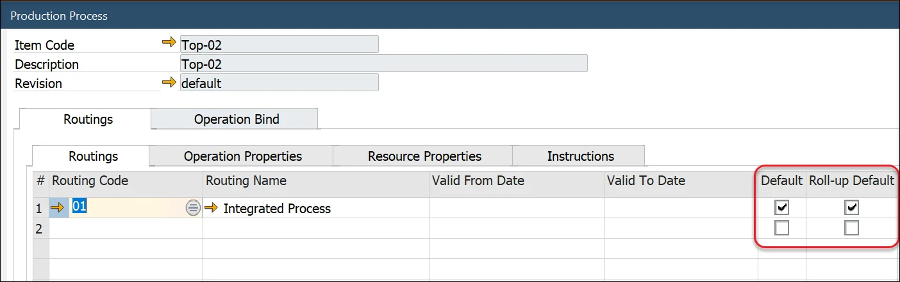
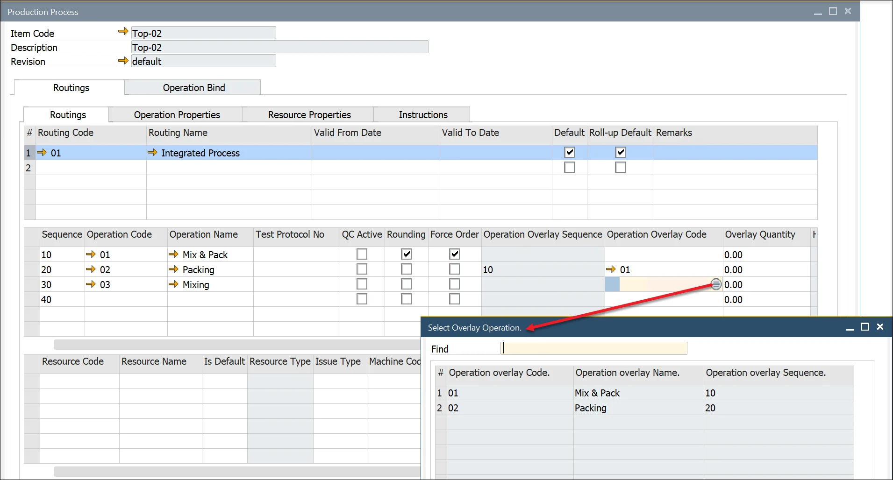
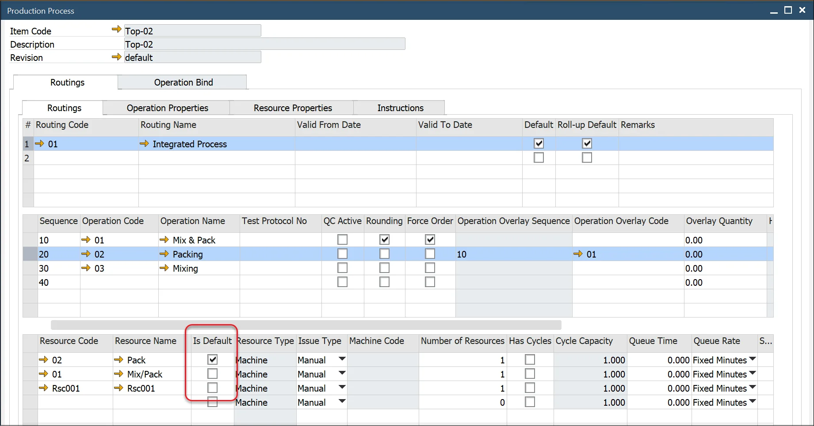
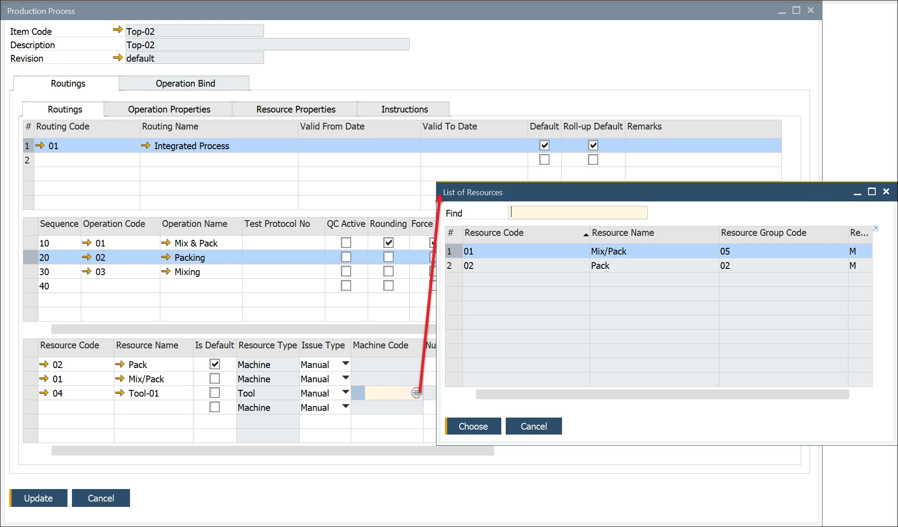
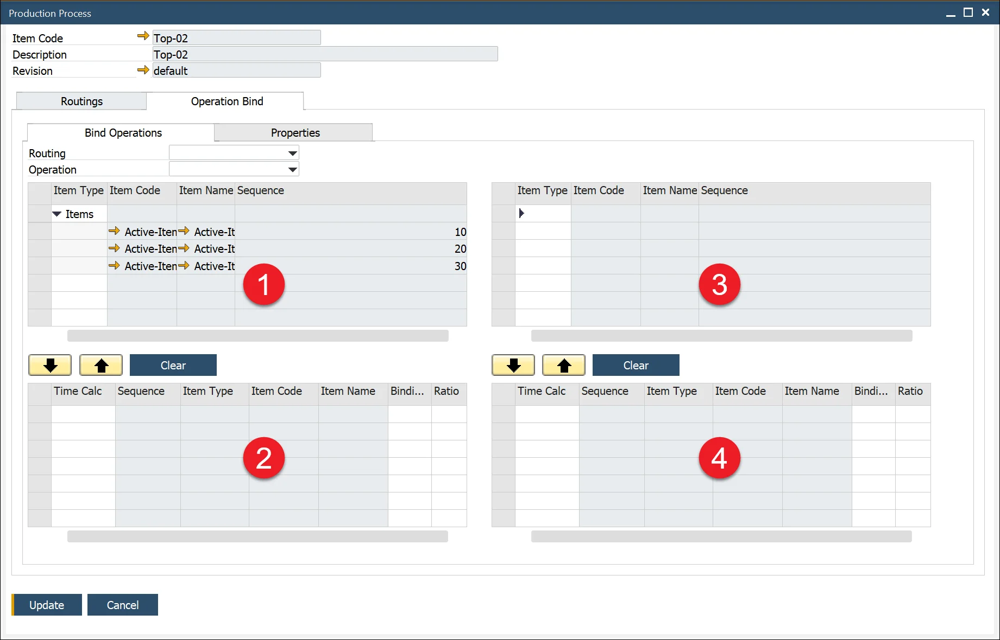
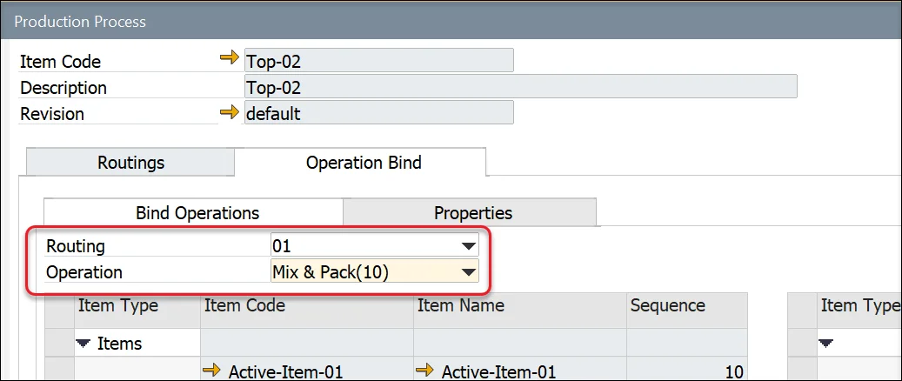
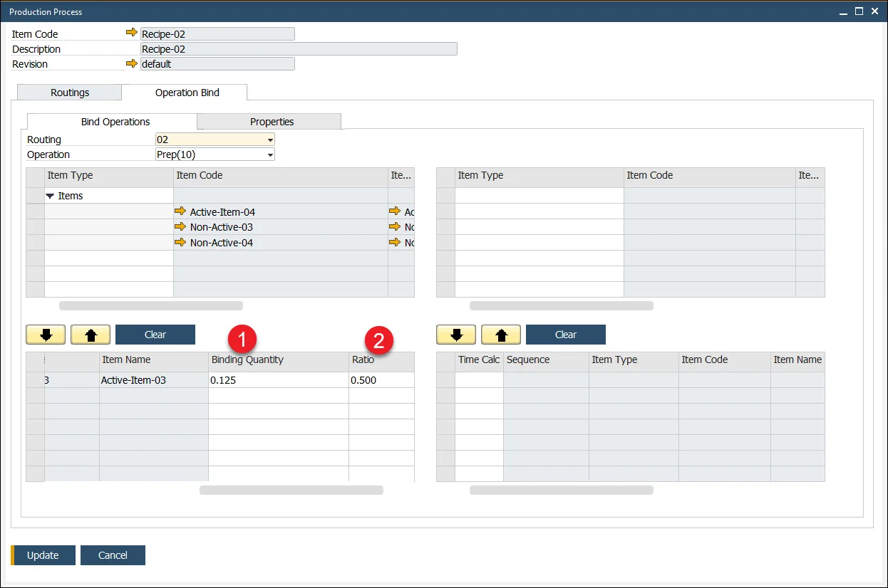
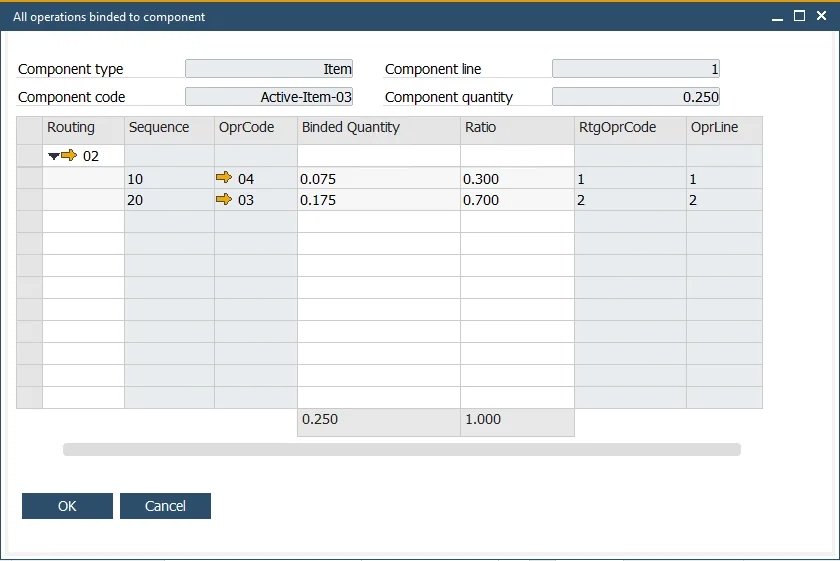
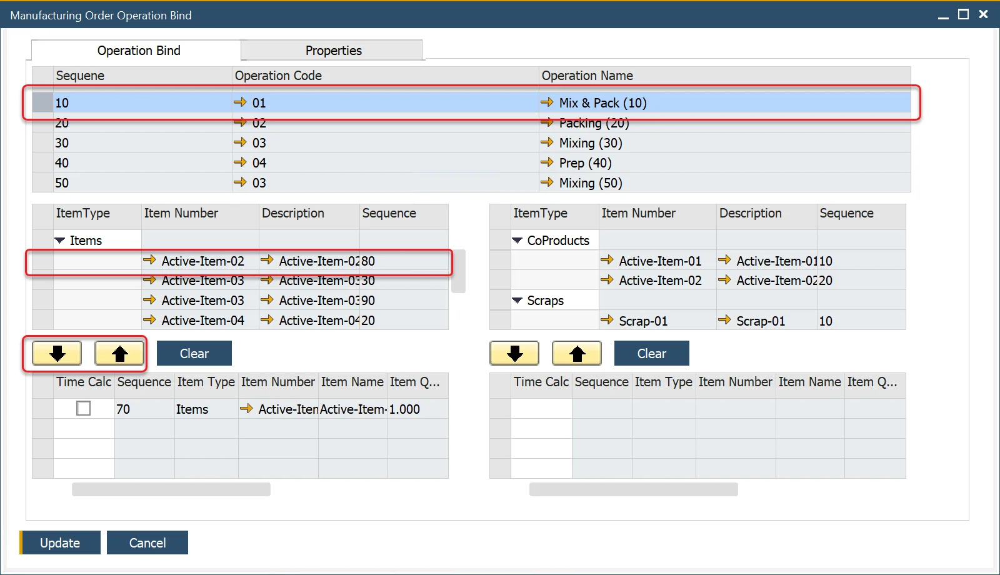
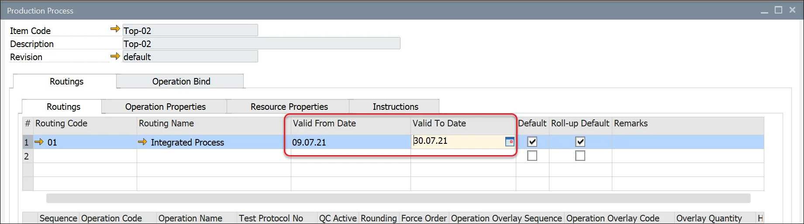

# Overview

Production Process allows assigning a specific [Routing](../../routings/overview.md) to a production Item and Routing to production Item and binding specific Items to Operations on a Routing.

---

## Adding a Routing

:::info Path
    Production → Bill of Materials → Production Process
:::

To reach the Routing form:

- open it through the main menu (the path in the frame above),
- go to the Bill of Material form, right-click on the header and select the Production Process from the context menu,
- go to the Item Details form, right-click on any revision line (in the Revisions tab) and select the Production Process from the context menu.

## Default Routing and Alternatives

Select and enter a Routing Code in the second column to add a Routing or multiple alternative Routings.

If the Routing is the default Routing to be used with Manufacturing Orders, check the box in the "Default" column.

If the Routing is the default Routing used for Product Costing, check the box.

## Operation Overlay

If the production process allows overlapping operations, the user can enter an Operation Overlay Code (Operation Code) and a Quantity, after which the next operation starts.

## Resources

Clicking on the Operation Code column displays the Resources within the Operation within the third section.

If required, for this specific combination of Item Code, Revision, Routing, Operation, and Resource, the Time and Rate values can be changed, additional Resources added, or existing Resources removed.

If there are alternative resources for the Operation, you can add several Resources and select one as the 'Default.'

## Tooling

To add Tool, select the related 'Machine Code.'

This example shows which machine the tool can be used for making the specific product.

## Operation Bind

Operation Bind allows users to link Items from the related Bill of Materials to Operations.

The window is divided into four parts:

1. Items that are available to be linked with the selected operation as an input to this operation.
2. Items that are already selected as input for operation.
3. Items that are available to be linked with the selected operation as an output of this operation.
4. Items that are already selected as an output of this operation.

To bind an Item to an Operation, choose a Routing and then Operation within it:

In Operation Binding, you can specify that you want to change the quantity used to calculate the selected operation time. In ProcessForce, an operation's time is calculated based on a planned quantity of a final product. The resulting quantity of the selected Item is taken under consideration during Operation time calculation. You can change the item chosen for considered by selecting the Time Calc checkbox.

To bind Items to a specific Operation, click the Item row and use the arrow to move it from the upper to the lower part of the form:

### Operation Bind Ratio

If you choose to bind an Item to more than one operation, its quantity has to be divided between the Operations. You can set the Binding Quantity (1) or Ratio on all related Operations. Please remember that the ratio has to sum to 1 to proceed.

You can check the Automatically Calculate Ratio on Operations checkbox (General Settings, ProcessForce, Bill of Materials, and Manufacturing Orders tab) to calculate the Ratio (and Quantity) automatically, e.g., add an Item to two Operations, and the ratio will be set to 0.5, and the Binding Quantity will be calculated based on the balance and the related Bill of Materials quantity.

Suppose you uncheck the Automatically Calculate Ratio on Operations checkbox. You bind an Item to multiple Operations. In that case, you have to manually set Quantity or Ratio for Ratio to sum up to 1.

You can check all the Operations bound to a Component and set the values by right-clicking on a Ratio field and choosing the Show all operations for component option:

### Manufacturing Order Operation Bind

Operation Bind can be defined or changed individually for a specific Manufacturing Order. To do that, click Operation Binding on the context menu on the Manufacturing Order header.

Click an Operation row and Item row and use arrows to bind both elements:

## Instructions tab

Instructions tab is available from the Production Process form, Routing tab. It is an editable text area that can hold any related text documentation.

## Validity Period

It is possible to set a period of validity for a Routing on a Production Process:

### Example usage

A specific company in the food industry for a particular Item has defined a single Bill of Materials but different Routings based on the period of the year (which can be connected to temperature, humidity, etc.).
