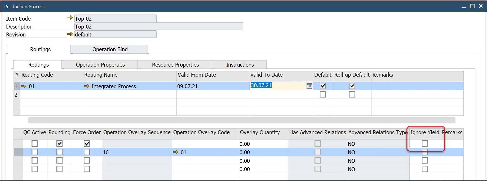
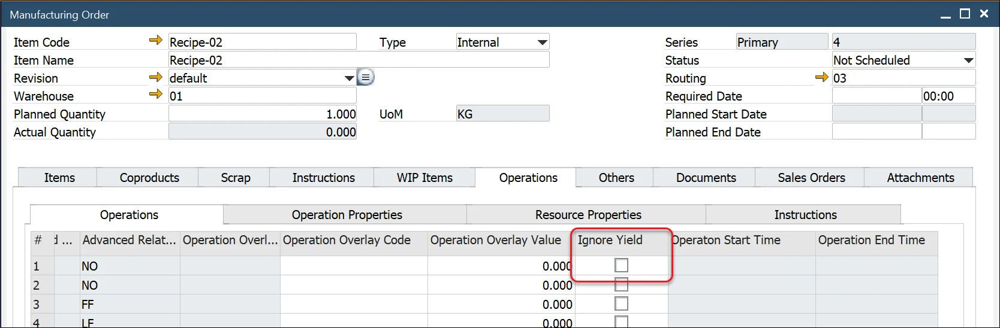

# Yield – Time calculation

Depending on the production process, the yield may impact the production time.

The yield value from the Bill of Materials header is default included in the planned resource quantity calculation. If the Ignore Yield checkbox is checked, ProcessForce uses the default Yield = 100 % for the scheduled resource quantity calculation. For example, if Yield = 80%, the planned resource quantity increases by 1.25 to meet the production output quantity (1/Yield% = 1/0.8 = 1.25).

The default setting will be copied to the manufacturing order.

