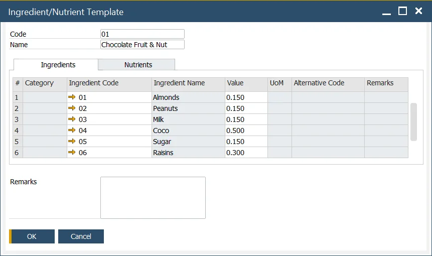

# Ingredient and Nutrient Template

:::info Path
    Inventory → Ingredients → Ingredient/Nutrient Template
:::

## Ingredient/Nutrient Template

This form allows users to define several ingredients/nutrients within a template to help with rapid data entry.

Ingredient/Nutrient Template can be used on the Item Ingredient Master Data form.

The ingredient can be added to the Ingredient tab by choosing Ingredient Code. Only value can be changed. A user can change other Ingredient attributes on the Ingredient Master Data form.

Nutrients can be added to the Nutrients tab by choosing Nutrient Code. Only value can be changed. A user can change other Nutrient attributes on the Nutrient Master Data form.

