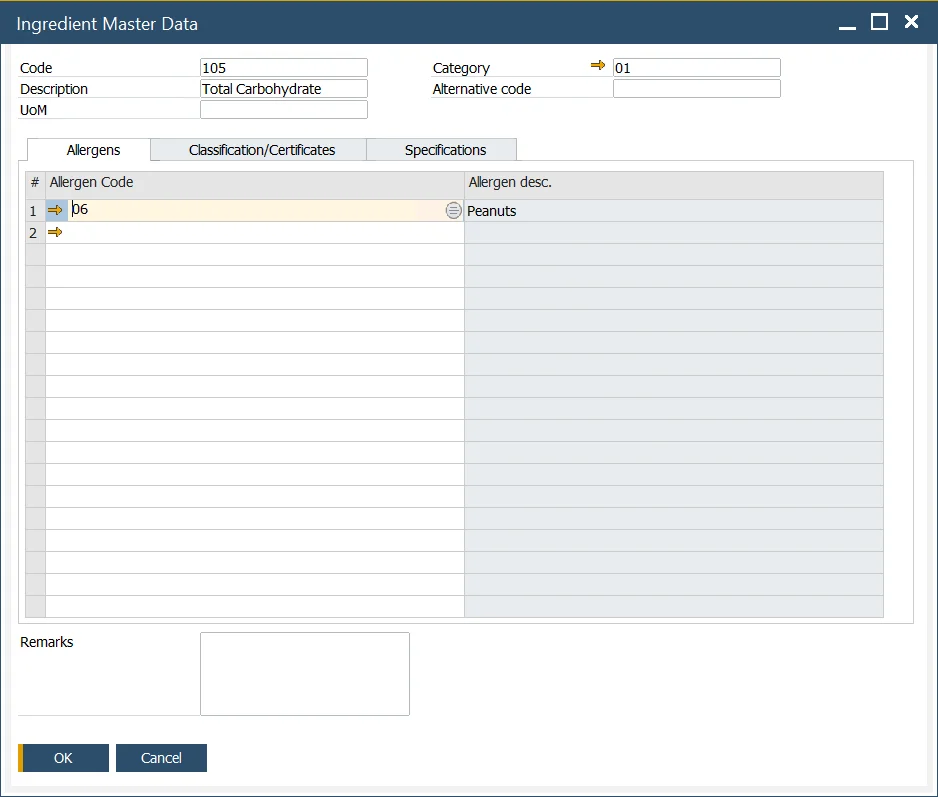
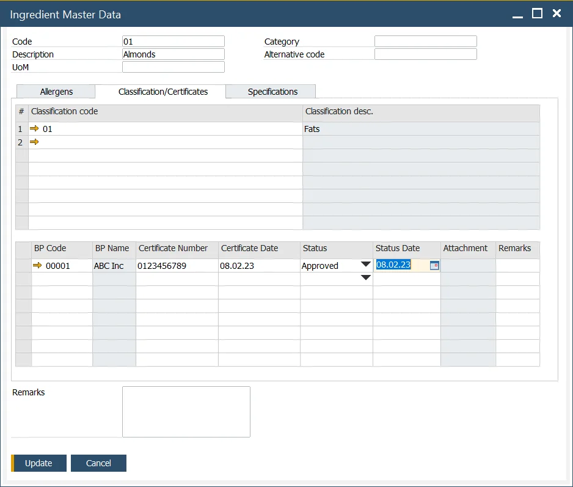
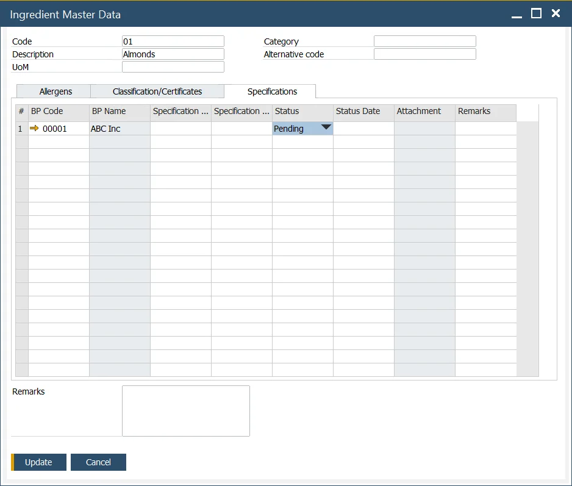

# Ingredient Master Data

In many instances, the Ingredient itself is an Item. For example, if the company makes fruit and nut chocolate bars, the cocoa, milk, raisins, hazel, and peanuts will be specific Items that are part of the product's Bill of Materials. Therefore, the user has the flexibility to define an Item and its detailed ingredient data.

Ingredient-defining functionality provides an extension to product Master Data giving the possibility to define information necessary to create declaration statements or ingredient listings needed on product labels.

This form allows the user to define and modify information on ingredients that are a part of products and materials and their attributes.

:::info Path
    Inventory → Ingredients → Ingredient Master Data
:::

## Form header

Here the following information can be defined:

- Code - an alphanumeric code assigned to a specific ingredient,
- Description - a name or a short description of a specific ingredient,
- UoM - Unit of Measure, e.g., kilogram,
- Category - ingredient category. To get more information, click here,
- Alternative code - standard, scientific codes governed by law, e.,g. E number - codes assigned to substances that can be used as additives to food products within the European Union and Switzerland.

## Tabs

### Allergens

A possibility to add predefined allergens contained by a specific ingredient. A code and a description of allergens can be displayed. To get more information on defining allergens, click [here](../ingredient-declarations/ingredient-settings/allergen.md).

### Classification/Certificates

A possibility to add predefined classifications and set details of certificates confirming that classification. For more information about refining classifications, click [here](../ingredient-declarations/ingredient-settings/classifications.md).

### Specifications

A possibility to create and modify a vendor or industry specification for an ingredient. The following information can be set:

- BP Code – a code assigned to the specific business partner,
- BP Name – a business partner name,
- Specification Number – a number assigned to a specific specification,
- Specification Date – date of a specification,
- Status – one of three options may be set for a specification:

  - Not Approved,
  - Pending,
  - Approved,
- Status Date – a status posting date,
- Attachment,
- Remarks.
