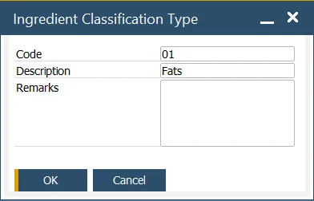

# Classification Types

This form allows users to define a valid list of classifications that can be assigned to products or materials. Classification records detail special requirements that products and materials must meet, such as Halal, Kosher, GM, Bio, and OGM. Corresponding certificates can be defined for classifications within the Ingredient Master Data form, Classification/Certificates tab.

This data is used within [the Ingredient Master Data](../ingredient-master-data.md).

:::info Path
    Administration → Setup → Ingredients → Classification Types
:::

