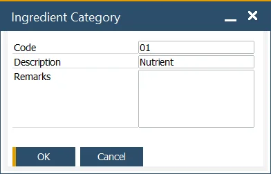

# Ingredients Category

This form allows the user to define ingredients/nutrient categories used to group similar ingredients, e.g., sugars and oils. A user can also add remarks important for a specific group.

This data is used within [Ingredient Master Data](../ingredient-master-data.md), [Nutrient Master Data](../nutrient-master-data.md), and [Item Ingredient Master Data](../ingredient-and-nutrient-template.md).

:::info Path
    Administration → Setup → Ingredients → Ingredient Categories
:::

