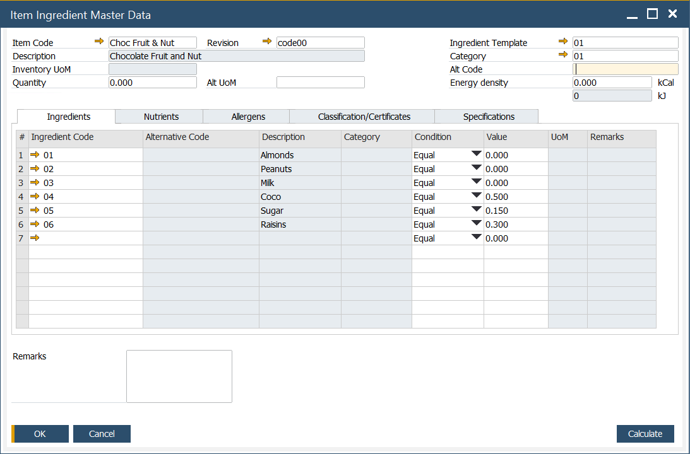
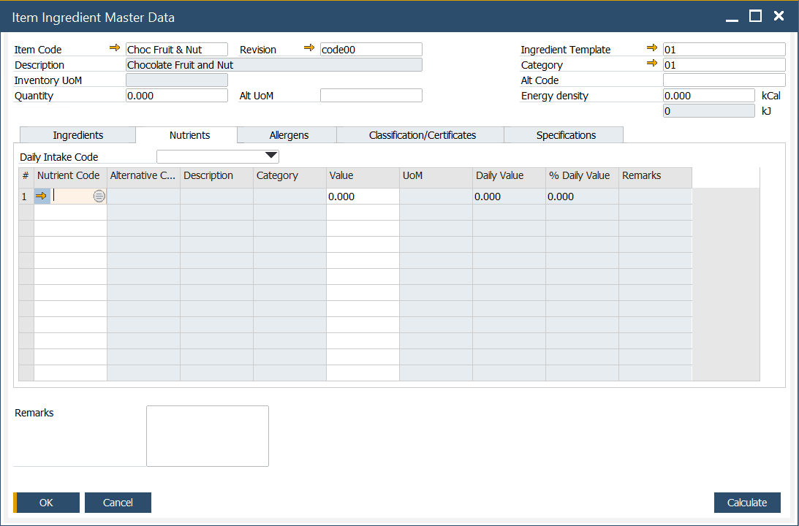
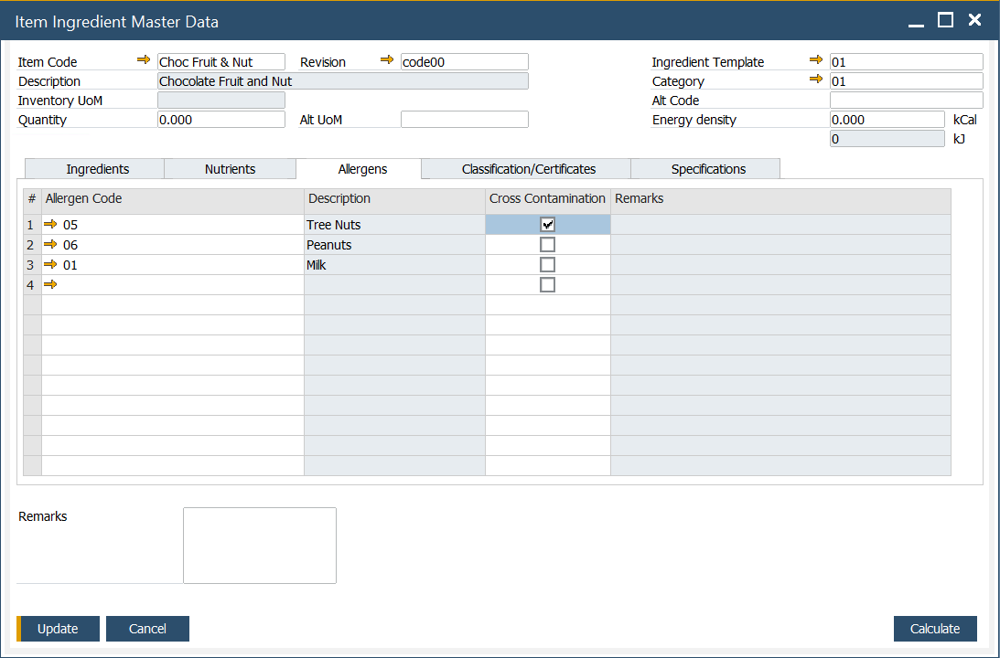
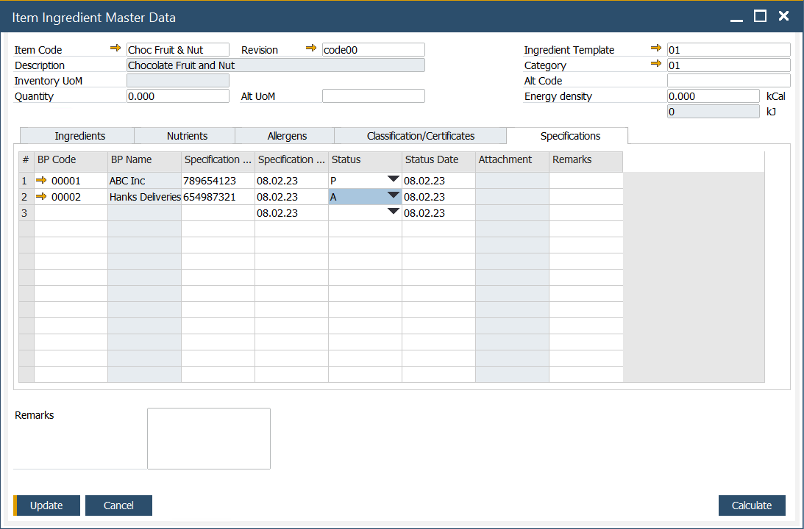

# Item Ingredient Master Data

The user can define ingredient and nutrient details for a specific Item in this form.

:::info Path
        Inventory → Ingredients → Item Ingredient Master Data
:::

## Form Header

Here the following information can be defined:

- Item Code – an alphanumeric code assigned to a specific item
- Description – a description of an item
- Inventory UoM – Unit of Measure, e.g., kilogram
- Alt UoM – alternative Unit of Measure
- Quantity
- Ingredient Template – a predefined list of ingredients. To get more information, click here
- Category – an ingredient category. To get more information, click here
- Alt Code – alternative code, can be used as standard, scientific codes governed by law, e.,g. E number - codes assigned to substances that can be used as additives to food products within the European Union and Switzerland
- Energy density – can be set in kCal units, a fixed value is automatically recalculated into kJ units.

## Tabs

### Ingredients

In this tab, predefined ingredients can be chosen. To get more information on defining ingredient details, click [here](../ingredient-declarations/ingredient-master-data.md).

### Nutrients

In this tab, predefined nutrients can be defined. To get more information on defining nutrients, click [here](../ingredient-declarations/nutrient-master-data.md).

Daily Intake template can be added by choosing a desired Daily Intake Code. To get more information on defining Recommended Daily Intake, click [here](../ingredient-declarations/recommended-daily-intake.md).

### Allergens

In this tab, you can set a list of allergens assigned to a specific item. To get more information on defining allergens, click [here](../ingredient-declarations/ingredient-settings/allergen.md).

If cross-contamination is possible for a specific allergen, it can be checked in a Cross Contamination column.

### Classification/Certificates

In this tab, information on related certificates can be set.

Certificates can be assigned to a specific classification. The certificate is a document confirming compliance with specific requirements for products of a company that holds the document. The following information can be set for a specific certificate:

- BP Code – Business Partner Code
- BP Name – Business Partner Name
- Certificate Number – ID number of a certificate
- Certificate Date
- Status – one of three options may be set for a specification:
        - Not Approved
        - Pending
        - Approved
- Status Date
- Attachment – a file attached to a specific certificate, e.g., a scan of a document
- Remarks

### Specifications

A possibility to create and modify a vendor or industry specification for an ingredient. The following information can be set:

- BP Code – a code assigned to the specific business partner
- BP Name – a business partner name
- Specification Number – a number assigned to a specific specification
- Specification Date – date of a specification
- Status – one of three options may be set for a specification:
        - Not Approved
        - Pending
        - Approved
- Status Date – a status posting date
- Attachment
- Remarks
