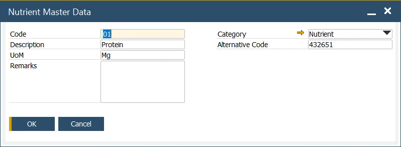

# Nutrient Master Data

:::info Path
    Inventory → Ingredients → Nutrient Master Data
:::

In this form, specific nutrient master data can be defined. Those data describe a quantity of a particular nutrient in a specific product. It can be used in Ingredient Declaration.

Nutrient Master Data specified here can be used on the Item Ingredient Master Data form.

The following data can be specified:

- Code – alphanumeric code assigned to a specific nutrient.
- Description – a name or a short description of a specific nutrient.
- UoM – Unit of Measure which is used with this nutrient, e.g., mg.
- Remarks – individually assigned data containing significant information about a nutrient.
- Category – Ingredients Category, for more information, click here.
