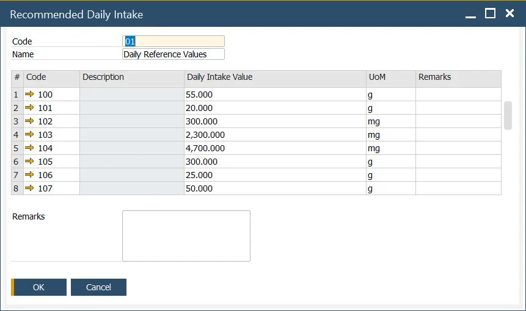

# Recommended Daily Intake

:::info Path
    Inventory → Ingredients → Recommended Daily Intake
:::

This form is used to define the list of nutrients that are used as the basis for calculating the recommended daily intake value details that are used to generate product labeling.

Data set in this tab are used on Item Ingredient Master Data form, Nutrient tab.

