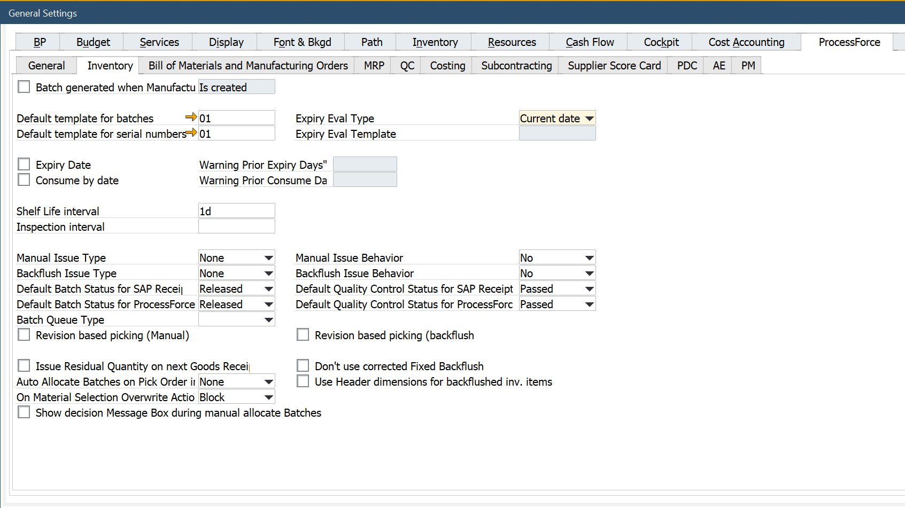

# Batch Control General Settings

Batch settings cover different batch-related functions, e.g., default batch status for different kinds of documents or Batch Templates. The settings can be set for three different levels, depending on the range of influence that a user wants to cover:

- General Settings
- Item Group
- Item Details

Click [here](/docs/processforce/user-guide/system-initialzation/general-settings/inventory-tab/) to check detailed information about Batch configuration (based on the example of General Settings).

---

## General Settings

Settings on this level are applied to any new Batches created. Click [here](/docs/processforce/user-guide/system-initialzation/general-settings/inventory-tab/) to find out more about these settings.

:::info Path
    Administration → System Initialization → General Settings → ProcessForce tab → Inventory tab
:::

## Item Groups Settings

If the Inherit from General Settings checkbox are unchecked, settings on this level are applied only to a specific Item Group.

:::info Path
    Administration → Setup → Inventory → Item Groups
:::

## Item Details Settings

If the Inherit from Item Group checkbox is unchecked, settings on this level are applied only to a specific Item.

:::info Path
    Inventory → Item Details → Batches tab
:::
