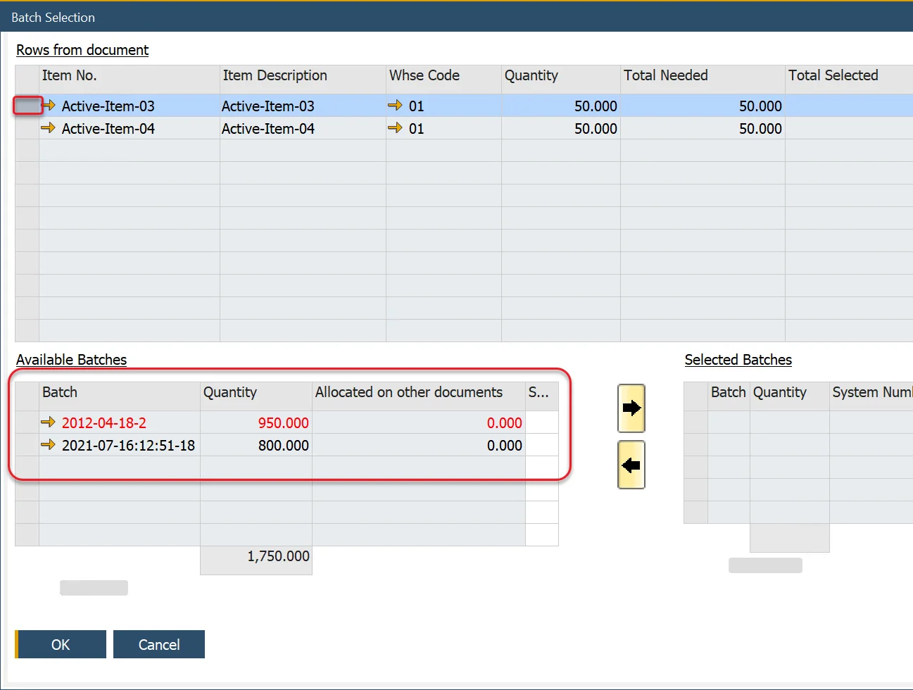

# Batch Status

## Batch Record Colors

Within Pick Order, the Batch records are displayed in different colors to provide their status information:

- Red – Expiry date has passed.
- Blue – Warning Expiry Date has passed.
- Black – both the Expiry date and Warning Date have not been reached.
- Grey – Locked and Non Accessible Batch set to DISPLAY based on [configuration settings](./manual-and-backflush-issue-type-configuration.md); Batch records are displayed but cannot be picked.

## SAP Business One Documents

The Batch color rules (apart from Grey) have been implemented within Delivery, Goods Return, Inventory Transfer, and Goods Issue documents.
