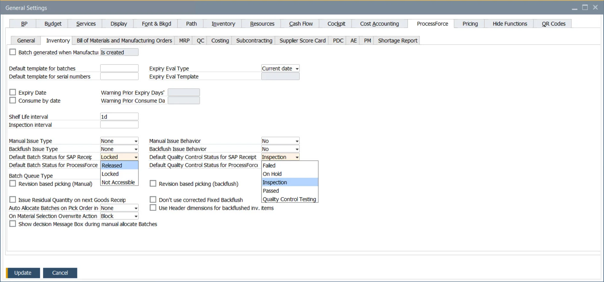
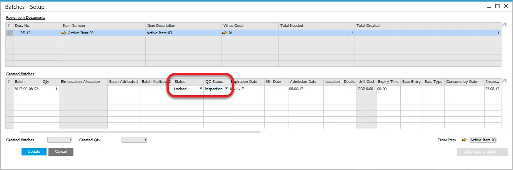
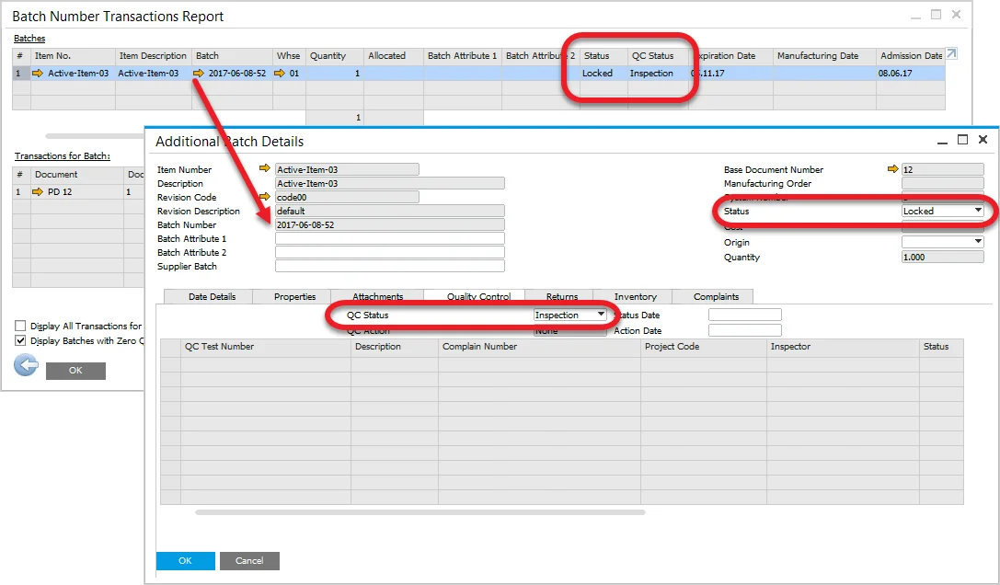
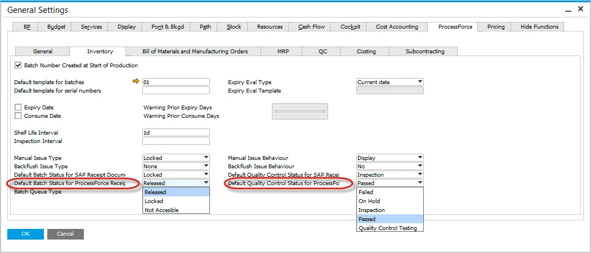

# Configuration Batch and Quality Control Status

## SAP Receipt Documents

The setting affects the following document types:

- Goods Receipt PO
- Goods Receipt
- Inventory Counting
- A/R Invoice
- A/R Credit Memo
- Reverse Invoice

A default Batch and Quality Status can be defined for the batch during the Receipt process.

The Quality Control status provides additional details to record the quality status of the batch, and is used for information purposes.

---

:::info
    Please note that Batches will take their default status from the setting only when a Batch is generated. The settings do not apply to Batches created manually.
:::

The default values are displayed within the Batches Setup and in the Batch Number Transaction Report window (along with QC statuses):

When opening the Batch Number Transaction Report the Batch and QC status are displayed.

The yellow arrow in Batch Number Transaction Report navigates to the Batch Master Data form, and the Batch Status is displayed within the header, while the Quality Control Status is shown in the new Quality Control Tab.

## ProcessForce Receipt Documents

The following receipt documents are supported:

- Pick Receipt

As per the above, the same rules apply.

