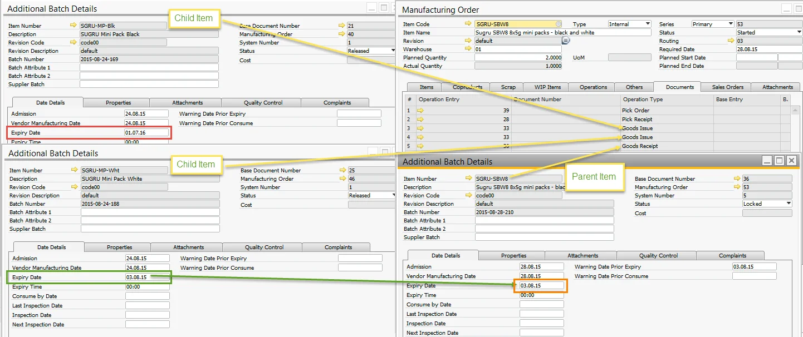

# Extended Batch Expiry Evaluation

Extended Batch Expiry Date allows setting expiry dates based on different dates or creating and using an expiry Evaluation Template that allows more complicated ways to calculate Expiry Date.

---

## Settings

:::info Path
    Administration → System Initialization → General Settings → ProcessForce tab → Inventory tab
:::

Expiry Evaluation Type can be chosen from a drop-down list; you can select either the Manufacturing Order related date (Start date of Manufacturing Order) or us Expiry Evaluation Template (for Goods Receipt PO current date is used).

**Expiry Date** and **Consume Date** – the final date for the Item to be safely used. The meaning of these two terms is slightly different, and usage of one of these often depends on the Customer's decision.

**Warning Prior Expiry Days** and **Warning Prior Consume Days** – an alert can be set to inform about Batch Expiry Date set up days before it (commonly used by companies to plan using the oldest Batches first).

**Shelf Life Interval** – Shelf life is the period during which food keeps its desirable or acceptable characteristics under specified handling and storage conditions. The shelf life interval is the period based on which Expiry/Consume date is automatically calculated. The date chosen in Expiry Eval Type field + Shelf Life Interval = Expiry/Consume date.

**Inspection Interval** – number of days after which Inspection should be performed to check Item quality (periodically), e.g., every ten days after batch record. An alert can be connected to the Inspection date.

## Levels of assignment

Expiry Evaluation Type, like other Batch settings, can cover three different levels:

- all Batches,
- specific Item Group Batches,
- specific Item Batches.

Click [here](./batch-control-general-settings.md) to check how to assign the Expiry Evaluation method to the specific level.

## Creation of Expiry Evaluation Template

:::caution
    Please note that Expiry Evaluation Template works only for Items with Manual Issue type, and the Batches must already be issued to production.
:::

If the option Expiry Eval Template is chosen in Expiry Eval Type, the Expiry Evaluation Template field is active, and it is possible to select a predefined Expiry Evaluation Template.

:::info Path
    Administration → Setup → Inventory → Expiry Date Evaluation Template
:::

The expiry Evaluation Template allows the definition of advanced Expiry Date Evaluation types. You can use predefined buttons to add a new element to a formula or type it in.

The expiry date Validation form will be displayed after clicking Validate Formula. In this form, you can check a result of a formula on a specific document.

**Example**

The following formula allows an Expiry Date of a Finished Item equal to the earliest expiry date of a Child Item batch (in case of different expiry dates on additional Child Items).

_MS SQL_

```sql
select
 isnull(min(t4.ExpDate ),getdate())
from
 [@CT_PF_OMOR] t0
 left outer join [@CT_PF_MOR5] t1 on t0."DocEntry"=t1."DocEntry"
 left outer join oitl t2 on t1.U_OperEntry =t2.DocEntry and t1.U_OperType=t2.DocType
 left outer join itl1 t3 on t2.LogEntry=t3.LogEntry
 left outer join obtn t4 on t3.ItemCode=t4.ItemCode and t3.SysNumber=t4.SysNumber
where
 t0.DocNum = %MORDN% and t4.ExpDate is not null, and t1.U_OperType='60'
```

_HANA_

```sql
SELECT IFNULL(MIN(T4."ExpDate"), NOW())
 FROM "@CT_PF_OMOR" T0
 LEFT JOIN "@CT_PF_MOR5" T1 on T0."DocEntry" = T1."DocEntry"
 LEFT JOIN OITL T2 ON T1."U_OperEntry" = T2."DocEntry" AND T1."U_OperType" = T2."DocType"
 LEFT JOIN ITL1 T3 ON T2."LogEntry" = T3."LogEntry"
 LEFT JOIN OBTN T4 ON T3."ItemCode" = T4."ItemCode" AND T3."SysNumber" = T4."SysNumber"
 WHERE cast (T0."DocNum" as nvarchar(11)) = %MORDN%
 AND T4."ExpDate" IS NOT NULL
 AND T1."U_OperType" = '60'
```

An example of the result of using this formula is presented in a screenshot below:


