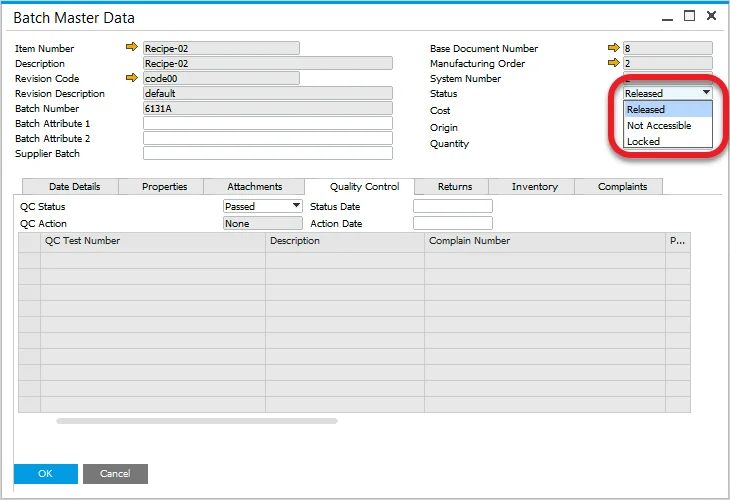
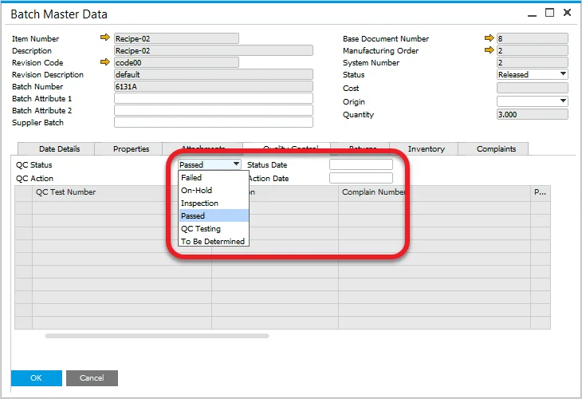
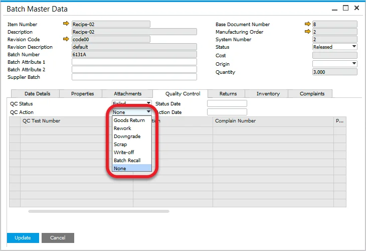
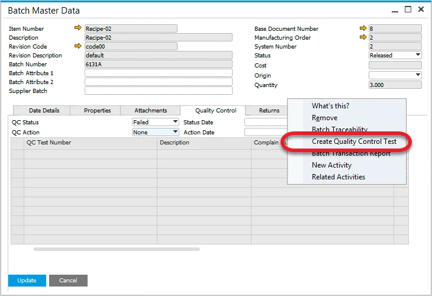

# Quality Control tab

Within the Additional Details Form, a tab has been added called Quality Control, where all related Quality Control tests for the batch are displayed, including corresponding Compliant Number and Non-Conforming Materials Report documents.

---

## Status

The Status field in the header of the form is the SAP Business One Status field, and the default status, based on the [configuration settings](../batch-control-settings/configuration-batch-and-quality-control-status.md).

## QC Status

The QC Status field in the Quality Control tab displays the quality status of the batch, and the default status, based on the [configuration settings](../batch-control-settings/configuration-batch-and-quality-control-status.md).

## QC Action

The field can be used to record an action to manage the batch if the QC status is set to Failed.

## Creating a Quality Control Test

A Quality Control Test can be created from the menu (if Test Protocol is assigned to the Item); additional information can be found [here](../../../quality-control/quality-control-test/overview.md).

