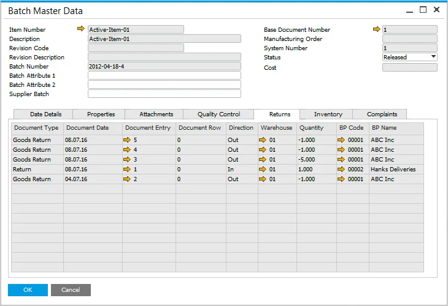

# Returns tab

On this tab, all document connected to returns for a specific Batch is displayed.

---

---

For delivered Items, the following documents (if there are any in the system) are displayed for the Batches which have been sold:

- Returns,
- A/R Credit Notes.

For purchased Items, the following documents are displayed (if there are any in the system) for Batches that have been purchased:

- Goods Returns,
- A/P Credit Notes.

For purchased and delivered Items, the following documents are displayed (if there are any in the system) for the Batches which have been purchased and sold:

- Goods Returns,
- AP Credit Notes,
- Returns,
- AR Credit Notes.

:::info
    In some countries, returns can be managed using Corrective Invoices. Documents of this kind connected to a specific Batch will also be displayed on the tab.
:::
