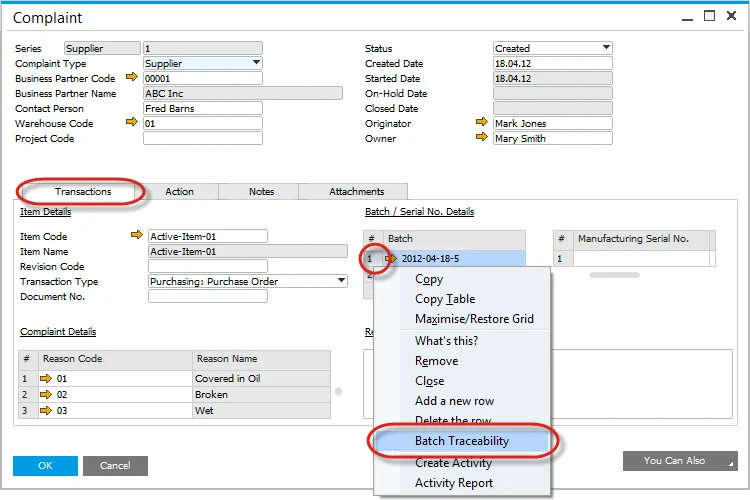
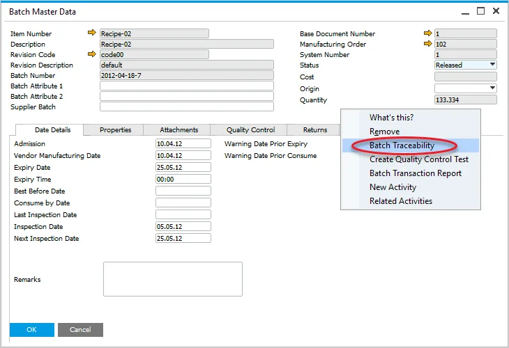
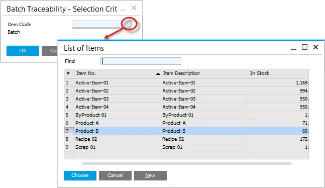
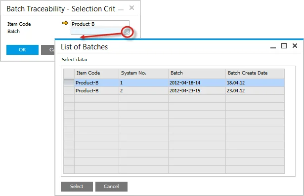
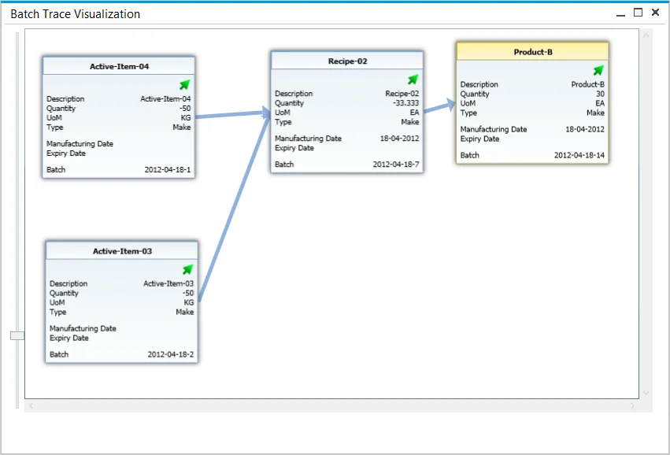
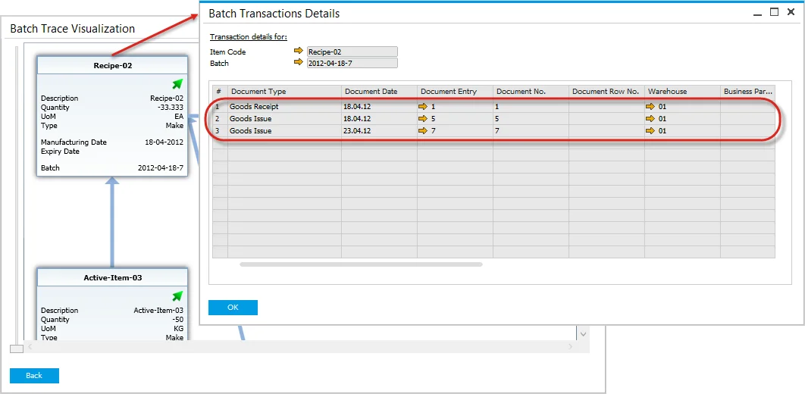
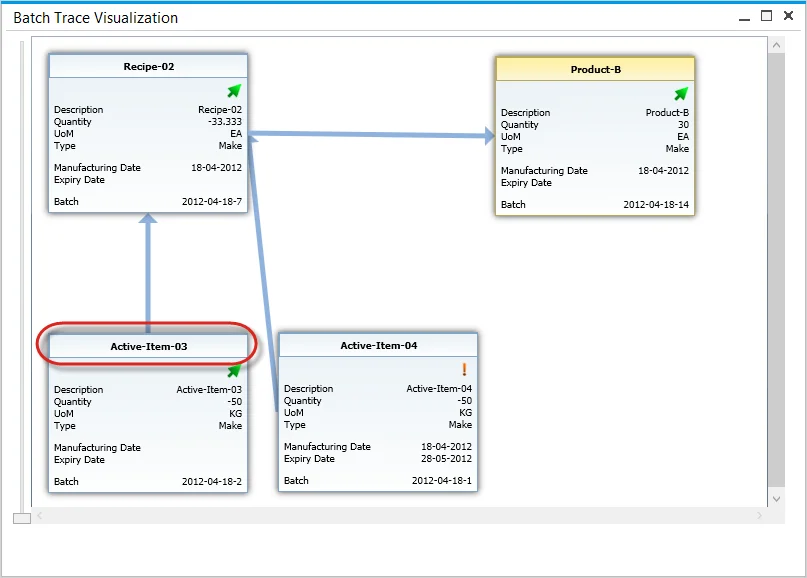
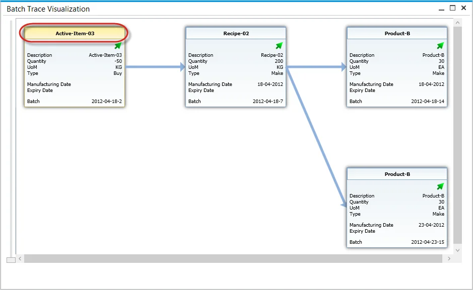

# Batch Traceability

ProcessForce Batch traceability function allows one to trace Item Batches throughout all their life in a company: from production (or purchase), being a part of a production process of another item, to delivery to a client. Instant access to Batch records is handy, e.g., in complaint management or recall process.

---

:::info Path
    Inventory → Item Management → Batches → Batch Traceability
:::

## Access

You can reach ProcessForce Batch Traceability by:

- Modules Menu (check the path above)
- Transaction tab on the Complaint form, right-click on a Batch.
  
- Batch Master Data form the context menu.
  

## Opening Batch Trace Visualization form

After opening the Batch Traceability function, Batch Traceability. Selection Criteria will open.

Choose Item Code from a list:

Choose a Batch from a list. Only Batches of chosen Item will be displayed:

Click the OK button to confirm the choice. A batch Trace Visualization form will be displayed.

## Batch Trace Visualization

ProcessForce Batch Traceability function is operated from the Batch Trace Visualization form:

On this chart, specific Batches are represented by boxes with their details. Boxes can be moved by drag-and-drop.

You can zoom in or out of the view using a mouse roll or a scroll bar.

Data included on Batch boxes:

- Batch status icon:
  - arrow – released,
  - x – not accessible,
  - exclamation mark – locked.
- Description
- Quantity – if it is negative, it indicates the quantity that was used in a production process,
- UoM – Unit of Measurement,
- Type – indicates if an item was produced or purchased,
- Manufacturing Date – if the Item was produced (not purchased),
- Expiry Date,
- Batch – Batch name.

## Transactions

Right-click on a specific box to see all activities and transactions connected to the Batch:

Click the yellow arrow in a specific document row to get more information about it.

## Going forward

In Batch Trace Visualization form shows what a specific Item was made of. It is looking back on every batch used in a production process to the point of a chosen Item.

You can also choose a Batch and go forward to see where the Items from a specific Batch were used. To do that, hold Control and right-click a desired Batch.

