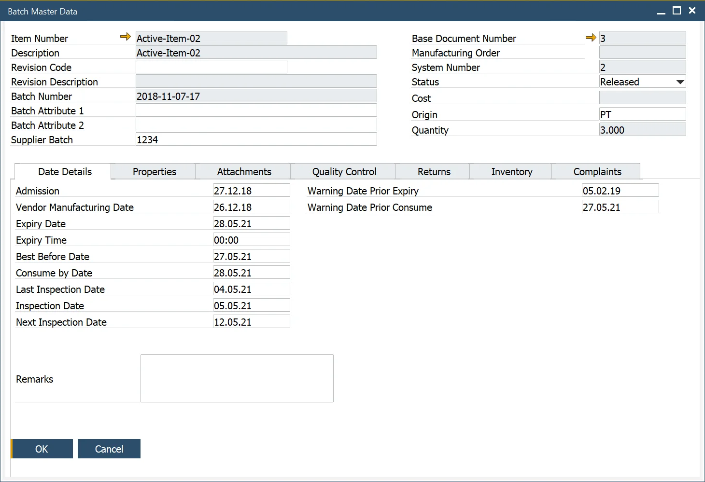

# Overview

Batches are groups of the same products. Batches are a base for traceability – a function that allows tracking down a specific raw material on every level of production and a product in later distribution, which can be used, e.g., in a fast and easy recall process. Batches functionality allows tracing a whole track that a specific product passed.

---

The SAP Business One Batch Details form and the ProcessForce Batch Master Data form have been consolidated into a single form. Navigation from all SAP Business One and ProcessForce documents and reports will open this new form.

**Note**: when adding User-Defined Fields to the SAP Business One Batch Details Table, the same User-Defined Fields (name and format, etc.) need to be added to the ProcessForce Additional Batch Tables.

:::info Path
Inventory → Item Management → Batches
:::

