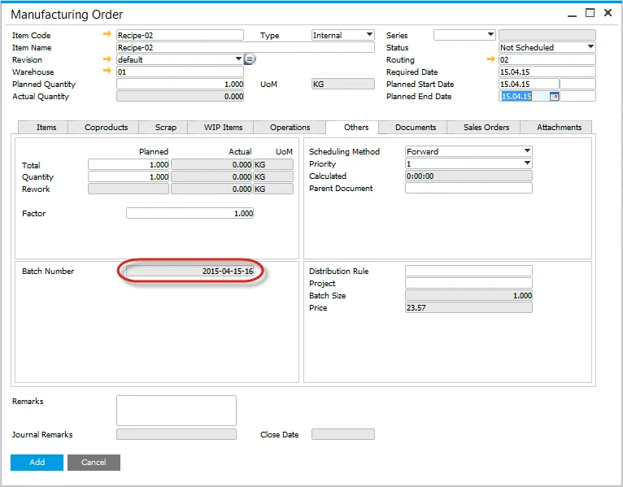

# Preallocation of a Batch Number

A Batch number can be allocated on creation of a manufacturing order or on its status change.

---

## Configuration

- This is a general setting; therefore, all items that are batch traced within production will be managed this way.
- Create a batch template using the Batch Template Definition.
- Check the Batch Number generated at the MOR checkbox and choose one of the options. When choosing one of the Status options, the batch will be generated on the appropriate status change or upon creating a Manufacturing Order with the specified status.

:::caution
    Note that when the Batch Number generated at the MOR option is checked, it is impossible to use Classification and MOR Number options on a Batch Template.
:::

## Manufacturing Order

The Batch Number has been allocated. You can check it on the Others tab.

:::note
    If you search for the batch number within the additional batch details, no record will appear, as the record has not updated the Additional Batch Details object.
:::

## Receipt from Production

The production transaction receipt will use the production order's batch number.

The same batch number will be used when performing multiple receipts for the same production order.
