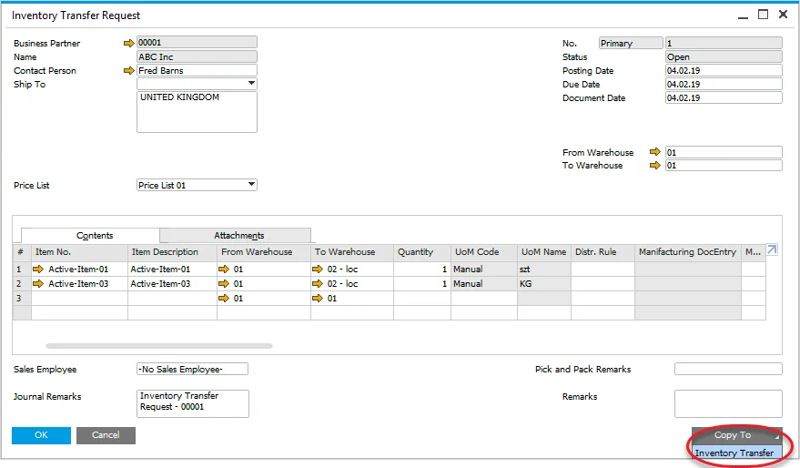

# Inventory Transfer Request and Inventory Transfer

Inventory Transfer is a document recording an inventory movement from one warehouse to another.

---

:::info Path
    Inventory > Inventory Transactions
:::

## Inventory Transfer

:::info Path
    Inventory → Inventory Transactions → Inventory Transfer
:::

Inventory Transfer is a document recording an inventory movement from one warehouse to another.

## Inventory Transfer Request

:::info Pathc
    Inventory → Inventory Transactions → Inventory Transfer Request
:::

This kind of document describes wanted inventory movement but does not cause it. Inventory Transfer Request can be copied to Inventory Transfer:

## Manufacturing Order based document

Inventory Transfer and Inventory Transfer Requests can be created for a specific Manufacturing Order. You can choose a desired option from the context menu on Manufacturing Order. Inventory Transfer and Inventory Transfer Request can be made either for components or all Items on Manufacturing Order.

A document based on Manufacturing Order communicates about it in the Remarks field.

