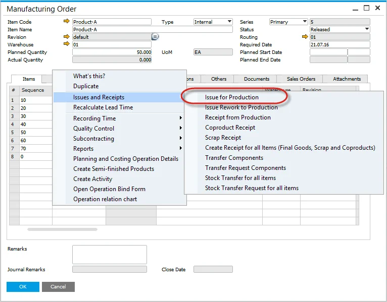

# Non-Batch Controlled Items

Here you can check how to perform Bin Locations and Allocations on Pick Order for Non-Batch Controlled Items.

---

## Pick Order

### Issue to Production Process

Select from the context menu, Issues and Receipts, Issue to Production.

### Non-Batch Controlled Items

- Enter the amount of inventory to be picked within the Picked Quantity field.
- Click on the yellow arrow in Bin Location Allocation to select Bin Location.
- Bin Location Allocation - Pick Order form opens.
- Manually enter a value in Allocated or select one of the Automatic Allocation functions.

## Production Goods Issue

Select from the context menu: Production Goods Issue. Click add to confirm the Production Goods Issue.

This will remove the Items from the Warehouse and Issue to Work in Progress and create the corresponding financial journal.
