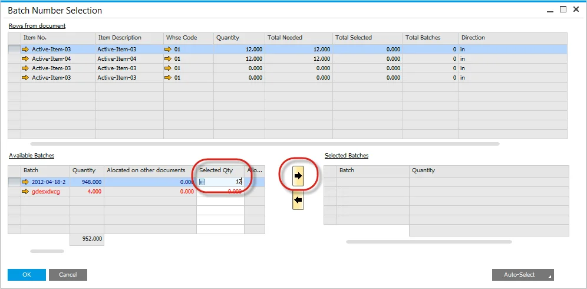
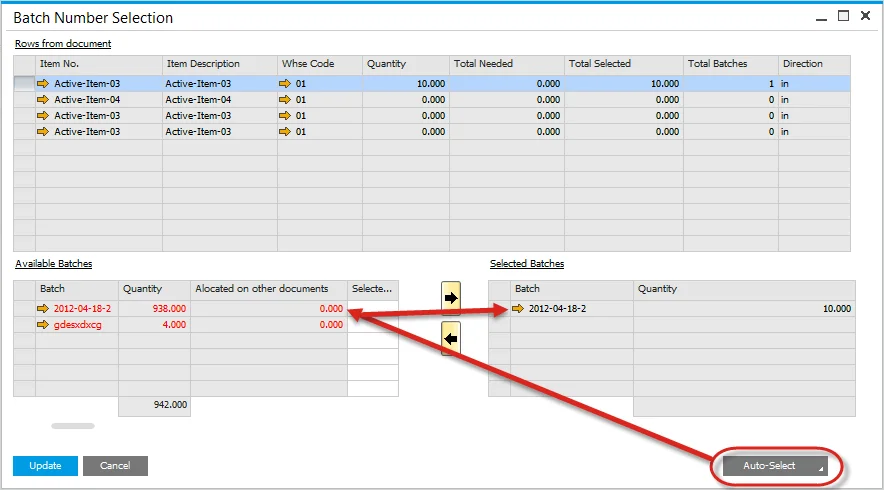

# Pick Order Bin Locations and Allocations. Batch Controlled Items

## Manual Picking

Enter the required quantity and press the right arrow, and the bin allocation will be added automatically based on the bin allocation rules:

## Auto Select Picking

Press the Auto Select button, and based on the batch allocation rules for the item, i.e., FIFO, FEFO, and FMFO, the required quantity, and the bin allocation are automatically selected.

If the setting Manual Issue Behavior within General Settings is set to display, the Auto Select function will not pick the Batch.
