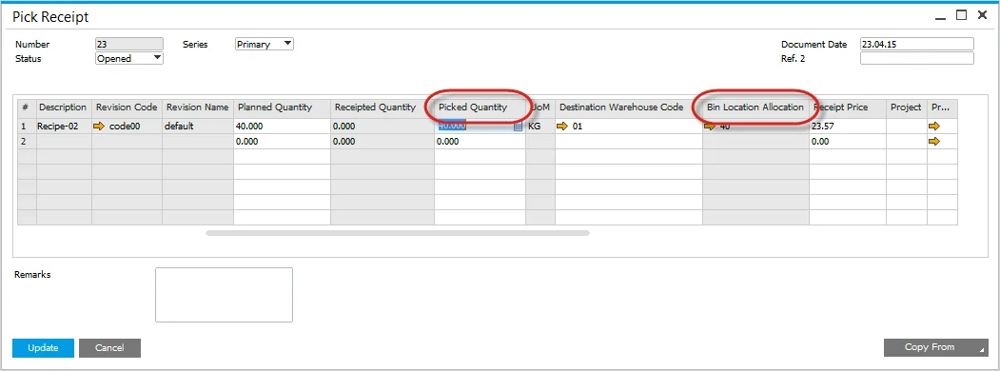

# Pick Receipt Bin Locations and Allocations

On this page, you can check how to manage location allocation on Pick Receipt documents.

---

## Pick Receipt

### Receipt from Production Process

Available from the context menu on the Manufacturing Order form, Issues and Receipts, Receipt from Production.

### Full quantity entered into Bin

Enter the Quantity within the Pick Receipt, and the full quantity is automatically added to the Default Bin Location.

Press the Update button to save the transaction.

### Split Quantity across several Bins

- Click on the yellow arrow within the Bin Location Allocation field.
- The Pick Receipt Batches - setup form will open.
  
- Click on the yellow arrow within the Bin Location Allocation field.
- The Bin Location Allocation - Pick Receipt form opens.
- Enter the Bin Location and Allocated quantity.
- Press Update.
  

## Production Goods Receipt

- From the context menu on the Manufacturing Order form, select Production Goods Receipt.
  
- Press Add button after setting the details of a document.
  
- Recorded has moved from Picked Quantity to Receipted Quantity.
  

### Backflush Materials

If there are backflushed materials within the Manufacturing Order, before performing the Production Goods Receipt, you can view if there are any material shortages.

- From the context menu, select Materials Shortage.
  
- If there are any shortages, they will be displayed within the Receipt Shortage form.
  
