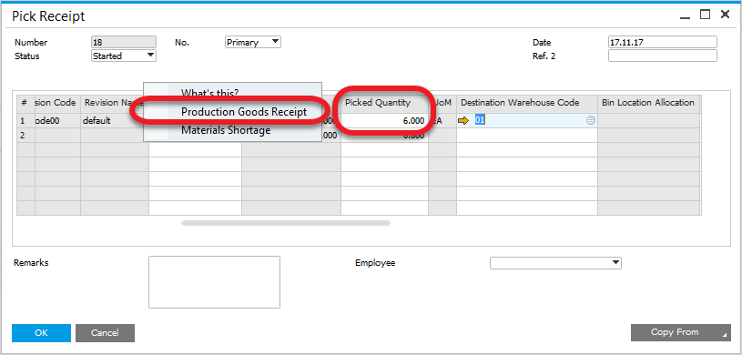

# Pick Receipt for a Batch Managed Items

In this example we will show how to perform Pick Receipt for Items Managed by Batches.

---

## Prerequisites

### Item Master Data

The item is managed by Batches.

    
Check how to set it up

    

        
Path: Inventory > Item Master Data

        
    

### Item Details

For this example we will set up a Batch Template that contains date and counter.

    
Check how to set it up

    

        
Path: Inventory > Item Details

        
    

## Scenario no. 1

- Create a Pick Receipt by using context menu option on a Manufacturing Order:

    

- Set Picked Quantity, click update and choose Production Goods Receipt from a context menu. Batch number is generated automatically and it is possible to check it in Batch Number Transaction Report (check the following steps):

    

- Open the created Goods Receipt from Manufacturing Order, Documents tab:

    

- On Batch Number Transaction Report (opened from Goods Receipt context menu) you can see that a batch number has been generated (based on the Batch Template) for the picked quantity (5 in this example):

    

## Scenario no. 2

- Create a Pick Receipt by using context menu option on a Manufacturing Order:

    

- Quantity is set up to 6. Pressing Ctrl+Tab in Picked Quantity field leads to Pick Receipt Batches - setup form (you can also reach the option by choosing Batch/Serial Numbers from a row's context menu – right-click on a first column):

    

- Here we can check generated Batch number or divide receipt goods into different batches:

    

- Create Production Goods Receipt by using Pick Receipt context menu option:

    

- Open created Goods Receipt from Manufacturing Order, Documents tab:

    

- Choose Batch Number Transactions Report from Goods Receipt context menu:

    

    As we can see, the Batches created on Pick Receipt Batches - setup were created for Production Goods Receipt.
