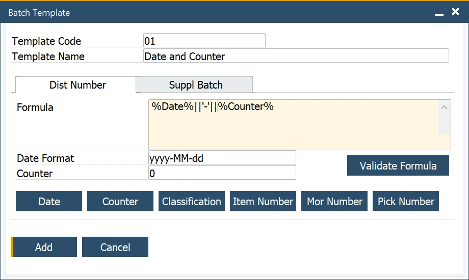

# Batch Template, Serial Template Definition

Here you can configure the default format of the batch number generator for creating batch and serial numbers during the receipt of Purchase and Production Orders. This information makes traceability and a batch and serial management process much easier. You can set a number generating template that contains important information, e.g. date, time, item number, or prefix.

:::note Path
    Administration → Setup → Inventory → Batch Template Definition
:::

Here you can configure the format of the serial number generator for creating serial numbers.

:::note Path
    Administration → Setup → Inventory → Serial Template Definition
:::

---

## Batch/Serial Template Allocation

The Batch Template form is used to define the Batch number for products that are Batch traceable. The formula is based on TSQL statements, providing a flexible Batch Number creation.


Batch templates (as well as Serial templates) can be set on three different levels:

- general <!-- TODO: Add Link --> for all Batch-traced Items
- for Item Group <!-- TODO: Add Link -->
- for a specific Item <!-- TODO: Add Link -->

If a Template is not specified for a specific level, a Template from a level above is used.

### General level

:::note
    Administration → System Initialization → General Settings → ProcessForce tab → Inventory tab
:::


You can decide when a Batch number is created considering the Manufacturing Order status. To do this, check the Batch Number generated at the MOR checkbox and choose one of the options. When selecting one of the Status options, the Batch will be generated on the appropriate status change or creation of a Manufacturing Order with the specified status.

:::caution
    Please remember that when the Batch Number generated at the MOR option is checked, it is impossible to use Classification options on a Batch Template <!-- TODO: Add Link -->.
:::

## Item Group level

:::info path
    Administration → Setup → Inventory → Item Groups → ProcessForce tab
:::

When checkboxes are unchecked, it is possible to set a Batch or Serial template for an Item Group.

When checkboxes are checked, General Settings Batch or Serial template is used.


## Item Level

:::info
    Inventory → Item Details → Batch Details tab
:::

When checkboxes are unchecked, it is possible to set a Batch or Serial template for an Item.

Item Group Settings Batch or Serial template is used when checkboxes are checked.


## Defining Batch Template

:::info Path
    Administration → Setup → Inventory → Batch Template Definition
:::

It is possible to define a Batch Template as a distribution number or a Batch Template assigned for suppliers. To do that, pick the desired category: Dist Number (for distribution Batches) or Suppl Batch (for Supplier Batches) tab.


It is possible to define a Serial Number Template as a distribution number, a number for manufacturing items, or a Lot Number. To do that, pick the desired category (Dist Number, Manufacturing, or Lot Number tab).

:::info Path
    Administration → Setup → Inventory → Serial Template Definition
:::


When adding a new Batch/Serial template, the date and counter fields have the following default values:

- Date = yyyy-MM-dd i.e. year-month-day
- Time = hh:mm:ss, i.e., hours:minutes:seconds
- Counter = 1. This is the starting value of the counter; it will increase starting with this value
- Maximum batch number = 32 characters, as per SAP Business One.

:::caution
    Please remember that the Formula field is planned for 255 signs. More extended formulas will not work correctly. You can use your database procedures and scalar-valued functions.
:::


<details>
    <summary>How to reach Batch Number Transation Report from Goods Receipt PO</summary>
    <div>
        
    </div>
</details>

### Example 1: Date and Counter

- Select the date function
- To string another element of data enter '+' sign for MS SQL version and '||' for HANA version
- To enter text or other symbols, enter the value between ‘ and ', e.g. '-'
- Select the counter function
- Click the Validate Formula button to check the Batch template syntax
- Click the Add button.



### Example 2: Date and Time

- Select the date function
- To string another element of data enter '+' sign for MS SQL version and '||' for HANA version
- Select the counter function
- Add the hours and minutes notions to the date. To do this, add the : separator, hh = hours, the : separator, and mm = minutes after the date format
- Click the Validate Formula button to check the Batch template syntax
- Press OK.

### Example 3: Adding the prefix

- To enter text or other symbols as a prefix to the batch number, use `[value]`, in this example, `PF` to get the PF prefix
- To string another element of data enter the + sign for MS SQL version and || for HANA version
- Select the date function
- To string another element of data enter '+' sign for MS SQL version and '||' for HANA version
- Select the counter function
- Click the Validate Formula button to check the Batch template syntax
- Click the Add button.


### Example 4: Embedding Item number

- To add the two first letters of the Item number:
  - enter left,
  - followed by (
  - select the item code function
  - followed by a ,
  - followed by the number of item code digits
  - followed by )
- To string another element of data enter the + sign for MS SQL version and || for HANA version
- Select the date function
- To string another element of data enter the + sign for MS SQL version and || for HANA version
- Select the counter function
- Click the Validate Formula button to check the Batch template syntax
- Click the Add button.


### Example 5: Incremental Batch Number starting with five zeros, and a maximum length of 6

- Select the date function
- To string another element of data enter the + sign for MS SQL version and || for HANA version
- To add an increasing number starting with five leading zeros
  - enter right,
  - followed by (
  - enter five zeros
  - followed by a ,
  - followed by the length of the total batch number
  - followed by )
- To string another element of data, enter + sign
- Select the counter function
- Click the Validate Formula button to check the Batch template syntax
- Click the Add button.


### Example 6: Using a specific value from a document in the Batch generation template

You can use others than specified in the Batch Template form fields to be incorporated in a Batch template. In this example, a Warehouse value is used. Batch template generation is unsuitable, but we can set User-Defined Values for the Classification field to incorporate a Warehouse value into a Batch name.

1. Create a new query in Query Generator (Tools → Queries → Query Generator), and type in $[PDN1,WhsCode] (the name of the warehouse field) in the Select field.

    

    <details>
        <summary>Click here to check how to chech a field name</summary>
        <div>
            1. go to Upper Menu → View → System Information and check the option (or click Ctrl + Shift + I):

            2. point the field with a cursor – the name of the field will be displayed in System Messages Log:

            
        </div>
    </details>

    Choose the name and Query Category and click Save:

    

2. Click the Classification field on Goods Receipt PO and go to Tools → Customization Tools → User-Defined Values - Setup:

    Choose the previously created query, set other values, and click Update.

3. From now on Classification field will be set on the Whse value on every change on the Whse field. Now, if you use Classification in Batch Template, a value for a warehouse will be incorporated in the template.

   In the same way, you can set values from a different field in the classification field and use them in a batch template.

### Example 7: Current date + shelf interval

The following formula allows for generating a Batch name with the current date + shelf lifetime added.

#### SAP HANA Studio – test

To use the query for a specific Item, use the following data:

    ```sql
    SELECT cast(ADD_DAYS(TO_DATE(CURRENT_DATE), (SELECT TO_INTEGER (RTRIM (T0."U_ShelfTime", 'd'))
    FROM "@CT_PF_OIDT" T0 WHERE T0."U_ItemCode" = 'your item code')) as NVARCHAR(36)) FROM DUMMY
    ```

#### Batch Template formula

The full query result has to be converted/cast as text:

    ```sql
    cast(ADD_DAYS(TO_DATE(CURRENT_DATE), (SELECT TO_INTEGER (RTRIM (T0."U_ShelfTime", 'd')) FROM "@CT_PF_OIDT" T0 WHERE T0."U_ItemCode" = %ItemCode%)) as NVARCHAR(36))
    ```

The result of the formula has to be a text value (NVARCHAR type, 36 characters; it is performed using the 'cast' command).

## Defining Serial Template

Serial Template defining process looks the same as the Batch Template defining process shown in the examples above.

### Generate serial numbers using custom procedure

#### <u>Requirements</u>

**Fields (order and types are important)**:

@NumberOfSerials int, @Counter int, @Date nvarchar(30), @Classification nvarchar(10), @ItemCode nvarchar(50), @MORNumber nvarchar(10), @PickNumber nvarchar(10)

**Procedure must generate 3 columns**

"SerialNumber" nvarchar(36) , "LotNumber" nvarchar(36), "ManufacturingSerialNumber" nvarchar(36)


