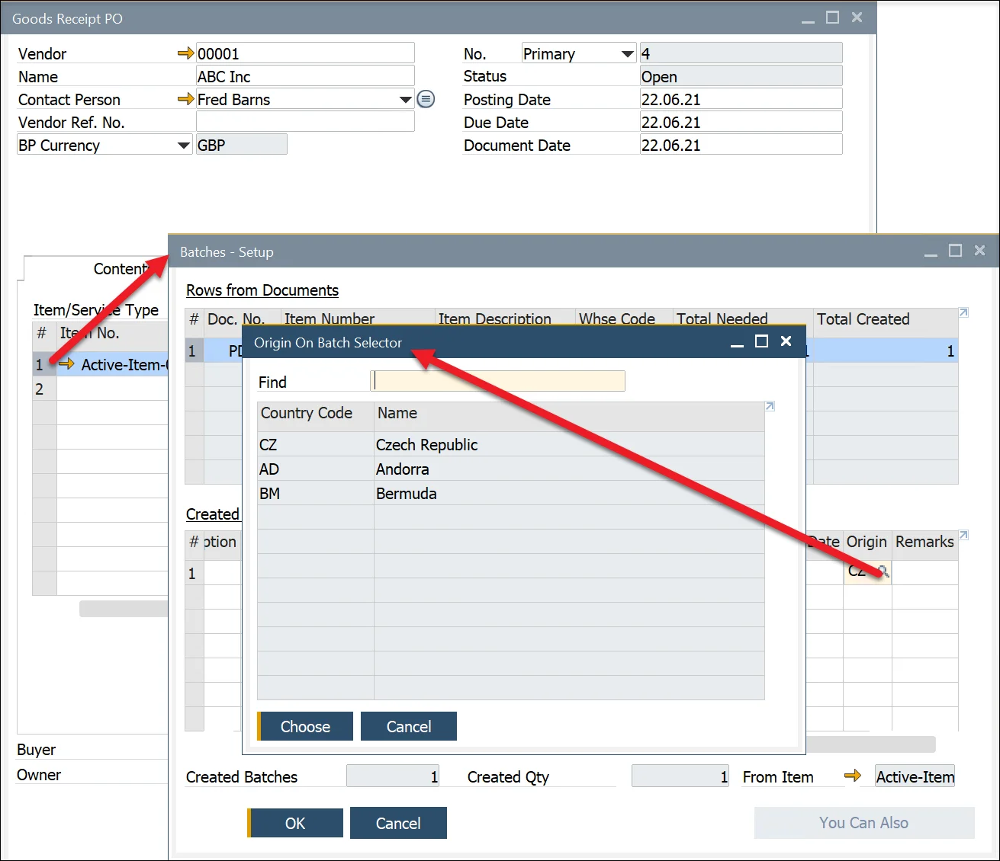
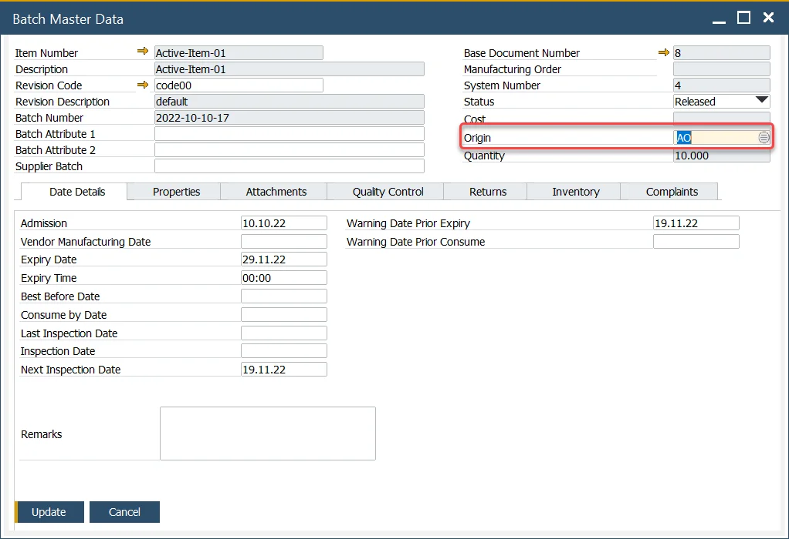
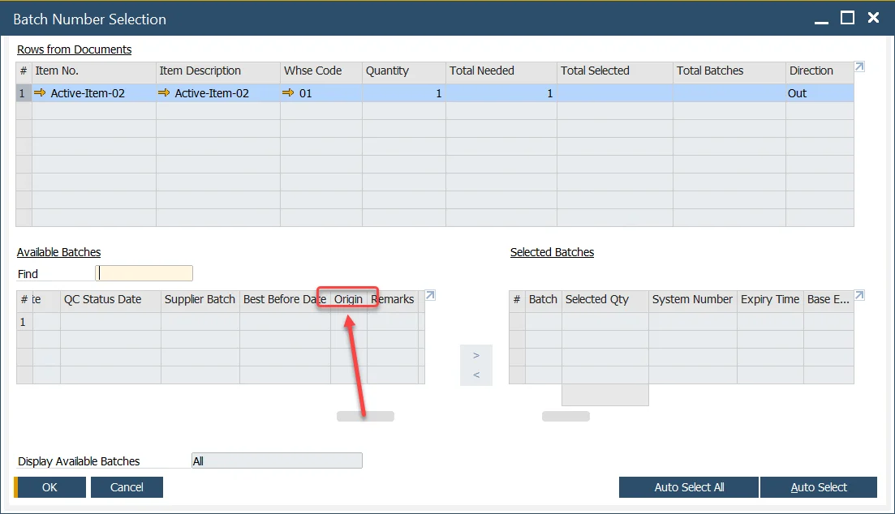

# Country of Origin

Country of Origin is the country of manufacture, production, or growth where the product comes from and is used extensively to support Country of Origin labeling (COOL), traceability, and specific ingredients in a Customers recipe.

To support this process, the associated master data are defined on the Item Details form.

:::note Path
    Inventory → Item Details → Origins tab
:::

## Origins Tab

You can choose one default country of origin and several alternative countries.

With two buttons, you can either copy a set of assigned countries from another Item Details record or clear already in-putted on the tab data.

## Batch Creation

During the Goods Receipt PO process, the default Country of Origin is added to the batch/lot record and, if necessary, can be overridden to one of the alternative origins.

To do this, choose an Item line on Goods Receipt, right-click, and select Generate Batches option.

When you choose an Item line in Created Batches table, go to the Origin column. The value is the default country selected on the Item Details form for the Item (check the previous section). On clicking the magnifier symbol, a list of items for the Item alternative countries is open. You can choose one of the values instead of the default one.

## Batch Record

The Origin is displayed on the Batch Master Data header. You can also change it from here to one of the alternatives defined in the Item Details form.

## Batch Selection

When picking a Batch, the Origin column is also displayed:

