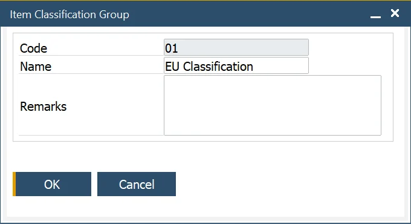

# Item Classifications

The Item Classification function allows the user to define specific classifications with its name and code, for example, corrosive, toxic, and non-toxic. Classifications can be grouped.

---

## Item Classifications

:::note Path
    Administration → Setup → Item Details → Item Classification
:::

In this form, you can define a specific classification. You can also choose on what kind of documents a specific classification can be used (by checking a corresponding checkbox).

## Item Classification Groups

:::note Path
    Administration → Setup → Item Details → Item Classification Groups
:::

The Item Classification Group function allows the user to create groups of item classifications, for example, EU Classifications.

## Item Classification assigning

Once created, classification can be assigned to an item in the Item Details form, Classifications tab. By clicking a second column and then a circle displayed within a field, a classification may be chosen:

A chosen classification can be assigned to a specific document type by checking a checkbox in a related column.
