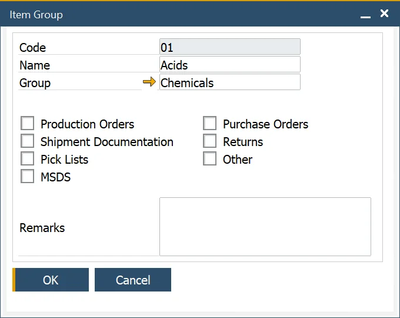

# Item Groups

The Item Group function allows the user to create groups of similar products, for example, acids, solvents, boxes, and bottles. A higher level is available too: groups of groups.

---

## Item Groups

:::note Path
    Administration → Setup → Item Details → Item Groups
:::

## Item Group Groups

:::note path
    Administration → Setup → Item Details → Item Group Groups
:::

The Item Group Group function allows the user to define a grouping of a grouping, which is used to group similar sub-sets of items to aid in reporting and analysis.

For example, an item can belong to the group boxes and another grouping packaging.

## Item Group assigning

A once-created item group can be assigned to an item in the Item Details form, Groups tab. By clicking a second column and then a circle displayed within a field, a proper Item Group can be chosen:

