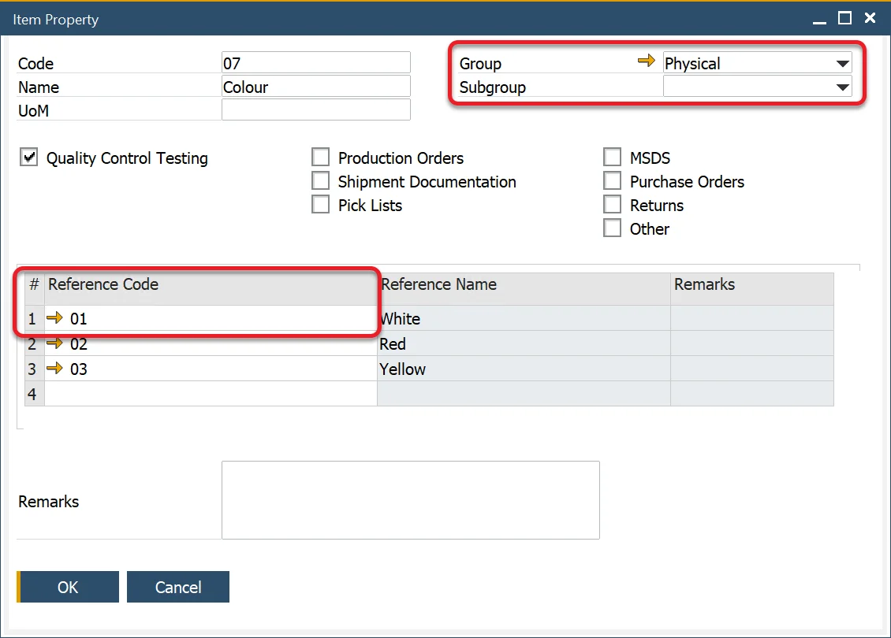
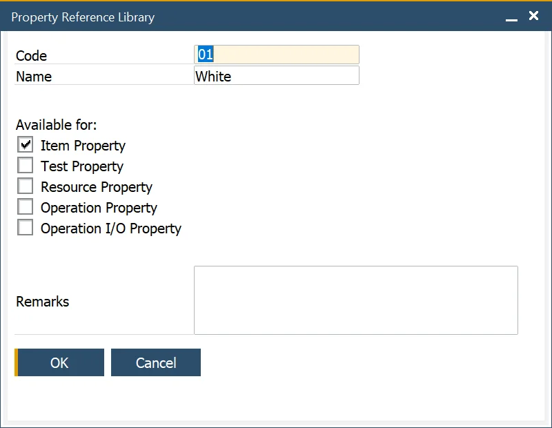
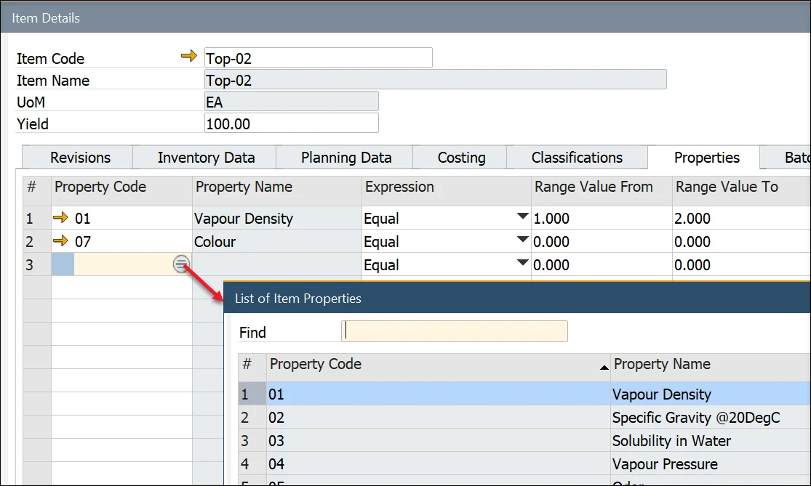
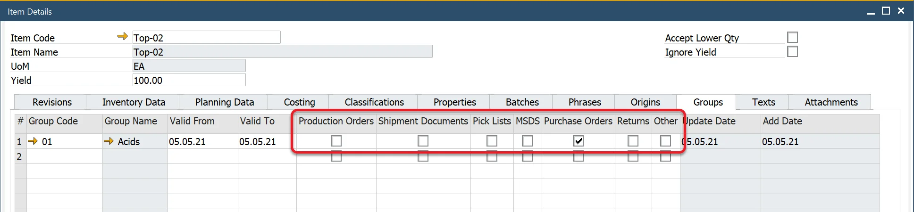
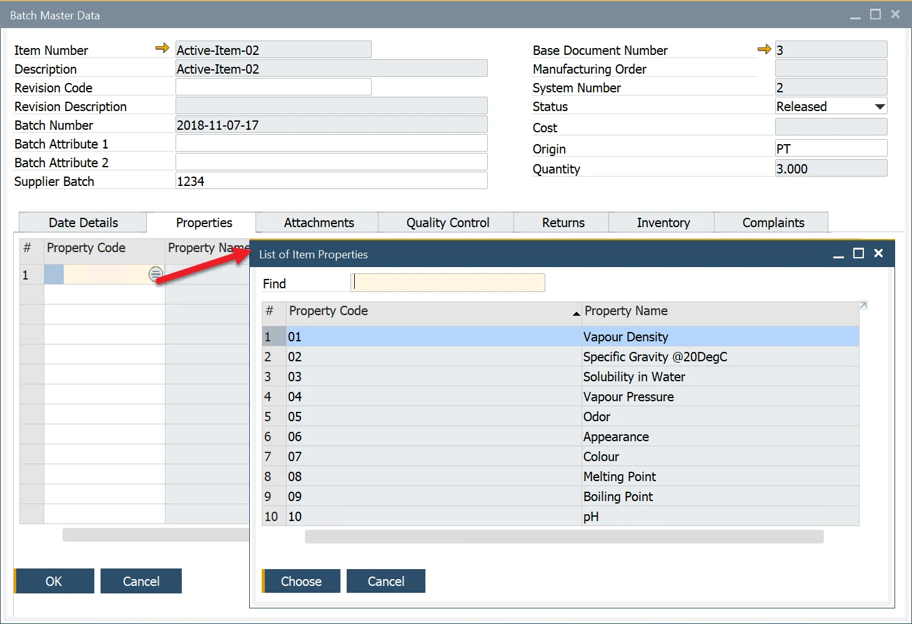

# Properties

This form allows the user to define a specific property – physical and chemical characteristics, e.g., color.

The corresponding groups and subgroups can also be defined, for example, physical and color.

A list of valid values may also be defined from the reference library. For example, color has valid values of yellow, blue, red, and green.

Checking the Quality Control Testing box implies that the Item Property will be used during the QC testing process.

---

## Item Properties

:::note Path
    Administration → Setup → Item Details → Item Properties
:::

## Item Property Groups

:::note Path
    Administration → Setup → Item Details → Item Property Groups
:::

This form allows the user to define a property group and its details.

You can define a name, a code, and remarks for a specific property group.

Many subgroups with their name, code, and remarks can be defined for every group.

For example, chemical properties can be divided into properties related to appearance or scent.

## Property Reference Library

:::note Path
    Administration → Setup → Item Details → Property Reference Library
:::

This form allows the user to create a library of valid values to be used in conjunction with properties.

These valid values can be available for a single or several property types relating to items, resources, operations, and operation inputs and outputs.

## Propery Assigning

### Item Details

Once created, the property can be assigned to an item in the Item Details form, Properties tab. By clicking a second column and then a circle displayed within a field, a property can be chosen:

A chosen item group can be assigned to a specific type of document by checking a proper check-box:

## Batch Master Data

:::note Path
    Inventory → Item Management → Batches → Batch Master Data
:::

Predefined properties can be assigned to a specific batch of a product.

