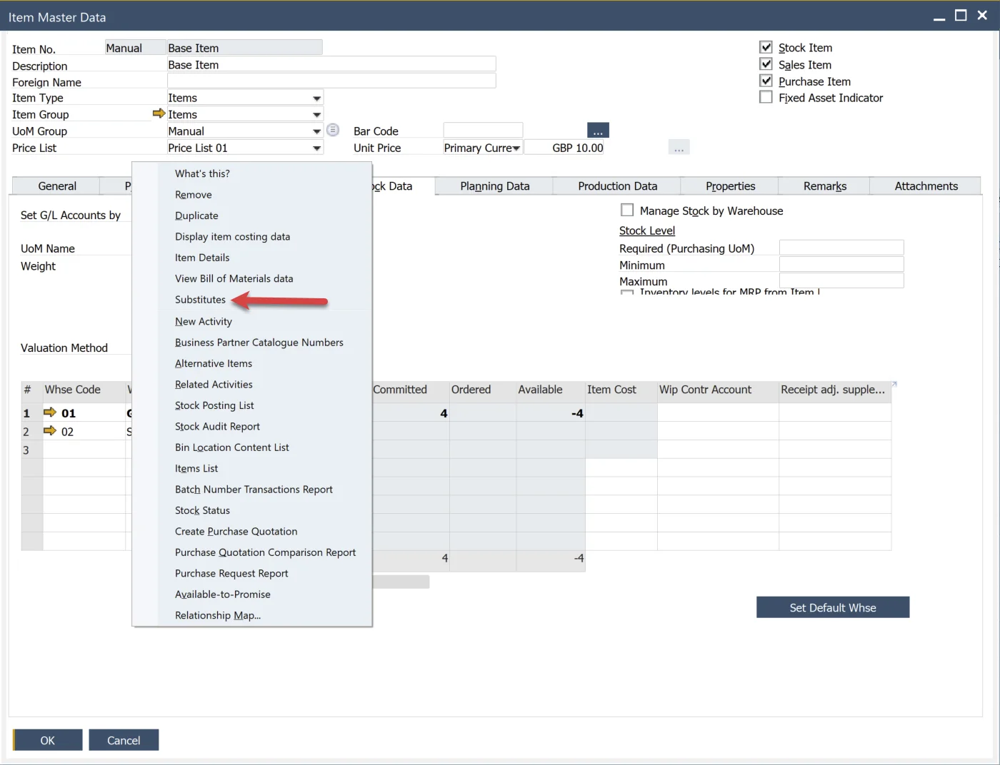
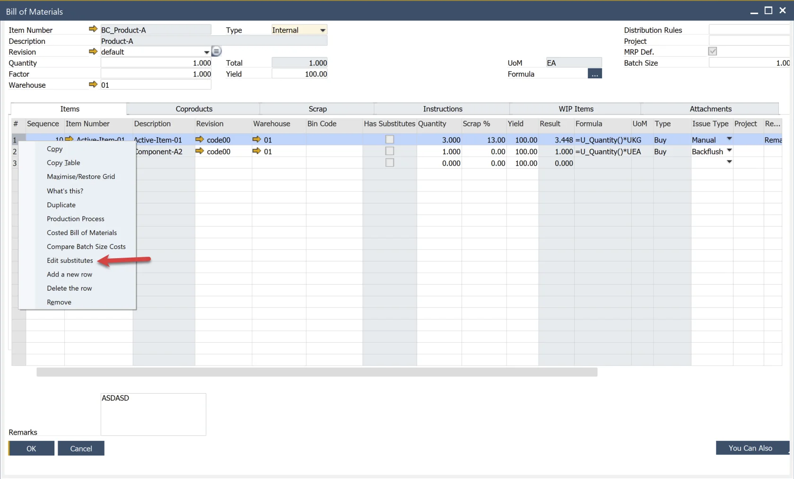
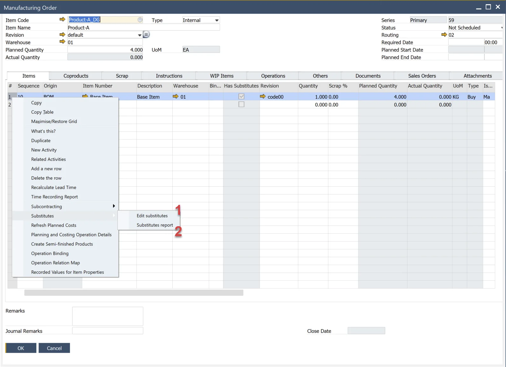
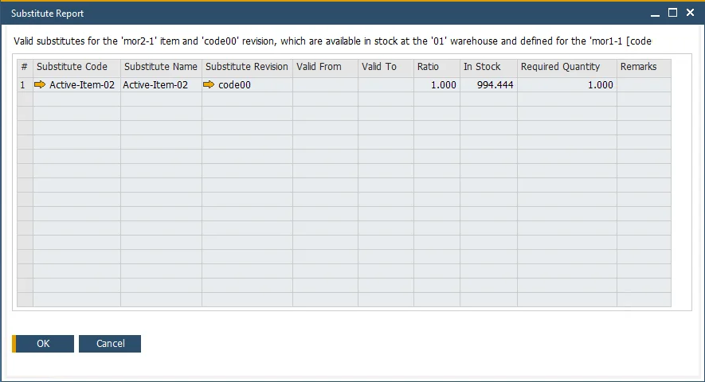

# Item Substitutes

## Overview

:::note Path
    Main Menu → Inventory → Substitutes
:::

It is possible to assign a replacement for any Item. If a specific Item is not currently available in Warehouses, it can be replaced on Pick Order by a Substitute defined for it.

It is possible to set the following settings for a Substitute:

Upper table: Item's revisions and their substitutes:

- Item Revision
- Substitute Code
- Substitute Name
- Substitute Revision
- For all Bill of Materials (1)
- Valid From; Valid To – time range of a Substitute validity
- Ratio – value expressed in decimal setting a ratio of replacement, e.g.:
  - 1.00 = 100%,
  - 0.5 = 50%,
  - 1.50 = 150%.
- Replace with Items/Coproducts/Scraps – determines whether a specific Substitute Item can be used to replace Items/Coproducts/Scraps

By default, Substitute is available for all Bill of Materials where substituted Item (2) / Revision (3) is used – checkbox For all Bill of Materials (1) selected:

Suppose you want to exclude substitution for a specific Bill of Materials or use different parameters than in the upper table only for a specific Bill of Materials. In that case, exclude substitution for a particular Bill of Materials or use other parameters than in the upper table only for specific Bill of Materials; it is possible in the bottom one – List of BOMs where the substitution is excluded or parameters are changed.

1. Unselect checkbox (1).
2. Choose BOM from the list (2) – appears list with all BOMs where the substituted Item is used.
3. To exclude substitution for the BOM, select the checkbox Disable Substitution.
4. To use different substitution parameters for selected BOM, leave checkbox (3) not selected.

## Item Master Data

You can also reach Substitutes form the Item Master Data context menu:

## Bill of Materials

You can also reach related Substitutes from the Bill of Materials context menu: right-click on the first column of a selected Item and choose 'Edit Substitutes':

## Manufacturing Order

There are two options available from the Manufacturing Order context menu. Right-click on a selected item's first column and choose 'Substitutes.' The first option works the same way described in the previous paragraph (1). The second displays a report of available quantities by Substitutes (2).

### Substitute Report

Please note that the following Substitutes are not listed in the Report:

- Substitutes out of stock for a given Warehouse,
- Substitutes invalid for a current day,
- Substitutes not defined for a given Warehouse,
- Substitutes excluded from a _BOM \_used for creating a \_Manufacturing Order_.

## Usage

You can change a specific Item for its Substitute on Pick Order by using Choose From List option for an Item:

