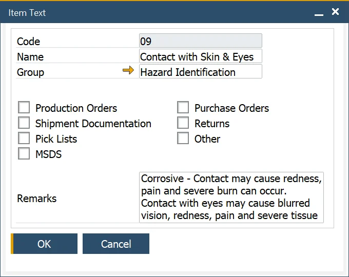
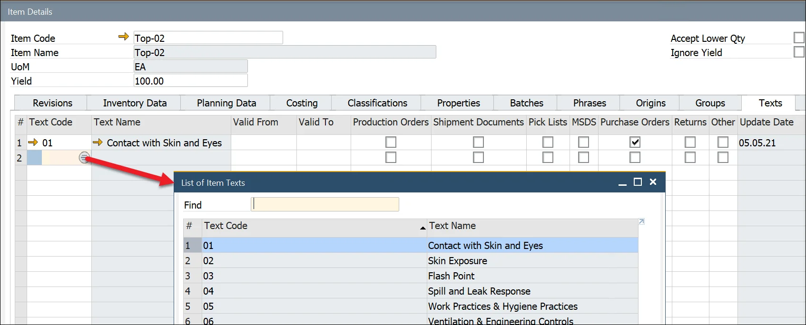

# Item Texts

The Item Text functions allow the user to define standard texts to describe the item.

For example, define hazard instructions, safety text, and cleaning information in case of product spillage. You can specify what document-specific Item Text will be used by checking the corresponding checkbox.

## Item Texts

:::note Path
    Administration → Setup → Item Details → Item Texts
:::

## Item Text Groups

:::note Path
    Administration → Setup → Item Details → Item Text Groups
:::

The Item Text Group function allows the user to define an Item Text Group, which is used to group similar item texts.

## Item Text assigning

A once-created item text can be assigned to an item in the Item Details form, Texts tab. By clicking a second column and then a Choose From List icon, a required Item text can be chosen:

A chosen text can be assigned to a specific type of document by checking a related checkbox.
