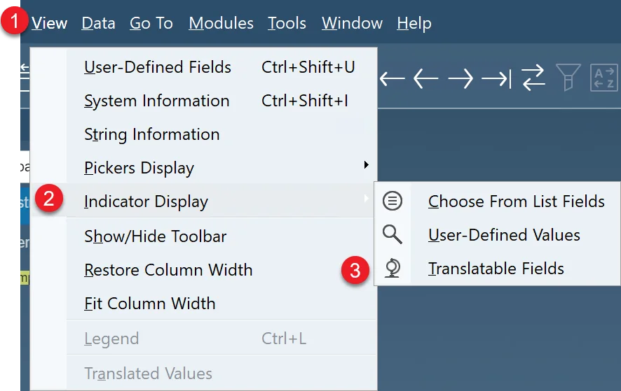

# MSDS, Labels and Documentation

## Compliance Data

Industries that sell their products locally and internationally must provide their customers with documents such as Material Safety Data Sheet (MSDS) in a functional language as supporting shipping documentation.

Using a combination of the forms listed below, MSDS master data can be defined.

- Classification

- Phrases

- Texts

- Groups

- Properties.

## Configuration

:::note Path
Administration → System Initialization → Company Details → Basic Initialization Tab
:::

Check the Multi-Language Support checkbox:

Go to the upper menu → Within View → Indicator Display, select Translatable Fields:

The Phrases form is used to define the EU Phrases lists. The code is the same in all countries, but the name is different in each language. Data source: http://schoolscout24.de/cgi-bin/rsp/rspinput.cgi

*Czech* **R1** Výbušný v suchém stavu.

*Dansk* **R1** Eksplosiv i tør tilstand.

*Dutch* **R1** In droge toestand ontplofbaar.

