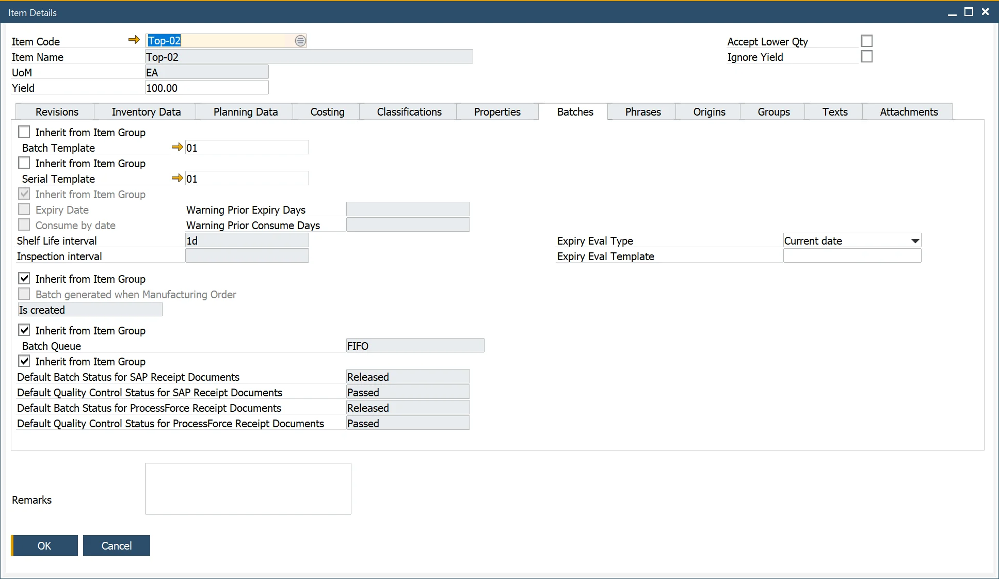

# Overview

The Item Details form is used to define the product master data associated with an item. ProcessForce provides a possibility to set an extended and diverse product definition. Item details make many item-associated activities easier, e.g. creating ingredient and allergen declaration, tracing batches, attaching files.

Item Details record is being created automatically when creating Item Master Data. If an Item Master Data was created before ProcessForce installation, a restore procedure must be performed to obtain Item Details to the Item Master Data. You can check how to do this [here](../system-initialzation/data-restore).

:::note Path
    Inventory → Item Details
:::

## Introduction

The Item Details form defines the master data associated with an item. These data elements include the following:

- Revisions; to define valid to and from dates
- Batch Details; to choose a batch template or serial template and define expiry/consume date and shelf life/inspection interval
- Properties; to define properties, for example, physical, chemical definitions, and nutritional details
- Classification; to categorize products, for example, toxic, non-toxic, hazard and non-hazard
- Phrases; to define, for example, EU phrases as part of MSDS, covering, for example, safety, hazard, and clean-up
- Groups; to group similar products together, for example, acids and solvents
- Text; to define, for example, hazard instructions, safety text, and cleaning information in case of a product spillage
- Item Property Reference Library; to define the valid values of a property, for example, color; white, black, blue
- Attachments, to reference, for example, MSDS, work instructions, safety sheets, production videos.

All the above forms, except the Item Reference Library, contain tick boxes for production orders, shipment documentation, pick lists, MSDS, purchase orders, returns, and others.

These relationships not only document within the system where these data elements are intended to be used but also can be used as a reference when building reports and documents.

To view video content to set this up, click here.

## Header

In the header, you can find the Item Code, Item Name, Unit of Measurement, and Yield fields, along with two checkboxes:

**Accept Lower Qty** – if it is checked on Manufacturing Order Items and this Item has issue type set to backflush, and there are not enough Items on stock, it will issue less than required without any error. On the next issue, the system will issue all previously missing quantities if there is enough in stock.

Please also check the following option to use it: [Issue Residual Quantity on the following Goods Receipt when possible](/docs/processforce/user-guide/system-initialzation/general-settings/inventory-tab/)

**Ignore Yield** – click [here](/docs/processforce/user-guide/item-details/yield-master-data/) to find out more.

## Revisions

This form allows the user to define and record the revisions of an item.

Revisions are used to record the product life cycle of a parent and item within a Bill of Materials. Revisions can be used to vary product structure for the same product.

Revisions can be entered for the following documents:

- Sales Orders
- Manufacturing Orders
- Test Protocols and Quality Control Tests
- Complaints
- Item Costing
- Additional Batch Details

Revisions are not visible within Inventory.

### Default

If more than one Revision is created for an Item, one has to be checked as 'Default.' This revision will be put by default in all revision fields on a document to which a related Item is added.

### Default for MRP

The field 'Default for MRP' is defined within the Bill of Materials form to determine which revision is the default for MRP planning purposes.

If 'Default for MRP' is grayed out, please create a Bill of Materials with a required Item Code and Revision. Reload the Item Details form.

ProcessForce revisions behave in the same manner as SAP:

- if both dates are empty – revision is valid all the time,
- if Valid From date is set up – revision is valid from this data,
- if Valid To date is set up – revision is valid to this date,
- if both dates are set up – revision is valid between these dates.

Four different statuses may be assigned to one revision:

- Active – revision is set and ready to work with
- Being Phased Out – is being prepared and is not ready to be used
- Engineering – is ready but waiting to be accepted
- Obsolete – is not in use anymore

### Default for Costing

This setting is relevant only for Items with the Standard Valuation method and is used for Cost Roll-Over. When you perform Cost Roll-Over on an Item with the Standard Valuation method on Revision that has the 'Default for Costing' checkbox checked, [Inventory Revaluation](http://localhost:3000/docs/processforce/user-guide/costing-material-and-resources/cost-categories#inventory-revaluation--standard-costing/) is created on a price change.

This field applies only to items with the Standard valuation method. For these Items, Inventory Items Cost is synchronized with the Item Costing of the selected Revision. If multiple Routings are defined for this Revision, then Routing selected as "Roll-up default" in Production Process will be selected for synchronization.

Suppose the Inventory Item Cost differs from the one in the "Default for Costing" Revision and "Roll-up default" Routing. In that case, the Inventory Revaluation document will be created during Roll-over to category 000.

On the other hand, if an Inventory Revaluation document is created manually, then a new Item Cost is updated for such a Revision and Routing.

## Batch Details

The yellow arrow leads to:

- Administration → Setup → Inventory → Batch Template Definition
- Administration → Setup → Inventory → Serial Template Definition

This form allows the user to choose [a batch or serial template for an item](/docs/processforce/user-guide/item-details/batch-serial-template-definition/). Users can select a template from the list or inherit it from the Item Group.

The user can also define the [expiry date or consume by date (or inherit from the item group)](/docs/processforce/user-guide/inventory/batch-control/batch-control-settings/extended-batch-expiry-evaluation/). If a user establishes an expiry date or consume-by date, it can specify the number of days prior warning. This initial warning data is used within an Alert query to notify those batches arriving at their expiry date.

When creating a batch record, the expiry date is auto-calculated based on the shelf life interval.

Batch Queue Type and Default Batch / Quality Control Status for SAP / ProcessForce Receipt Documents options are available to set in the Batches tab in the Item Details form. Default batch and quality control status can be set for SAP B1 and ProcessForce receipt documents.

The Inspection date is also auto-calculated for the batch and is displayed within the Batch Master Data form (see below).

To get more information on this subject, click [here](/docs/processforce/user-guide/quality-control/quality-control-test/creating-qc-test-from-batch/).

## Properties

The yellow arrow leads to:

- Administration → Setup → Item Details → Item Property Groups

- Administration → Setup → Item Details → Property Reference Library

This form allows the user to add and remove properties for the item master. Properties define physical and chemical characteristics.

The user can select from many expressions to record, for example, a specific value or a from/to value, dependent upon the expression.

## Classifications

The yellow arrow leads to:

- Administration → Setup → Item Details → Item Classifications

This form allows the user to add and delete classification codes for the item master. Classifications categorize products, e.g., as toxic or non-toxic. By checking the required checkbox, classification can be connected to certain kinds of documents.

## Phrases

The yellow arrow leads to:

- Administration → Setup → Item Details → Item Phrases refer to safety or risk phrases used to create a Material safety data sheet. By checking the required checkbox, phrases can be connected to certain kinds of documents.

## Origins

Country of Origin is the country of manufacture, production, or growth where the product comes from and is used extensively to support Country of Origin labeling (COOL), traceability, and specific ingredients in a Customers' recipe.

Click [here](/docs/processforce/user-guide/item-details/country-of-origin)to find out more.

## Groups

The yellow arrow leads to:

- Administration → Setup → Item Details → Item Groups

This form allows users to add and delete groups for the item master. Group describes similar products, e.g., acids. By checking the required checkbox, groups can connect to certain documents.

## Texts

The yellow arrow leads to:

- Administration → Setup → Item Details → Item Texts

This form allows the user to add and delete item text <!-- TODO: Add Link --> for the item master. Any text, e.g., hazard instructions or safety texts, may be added. Texts can be connected to certain kinds of documents by checking the required checkbox.

## Attachments

This form allows the user to attach documents to the item master.

This operates in the same way as SAP Business One.
