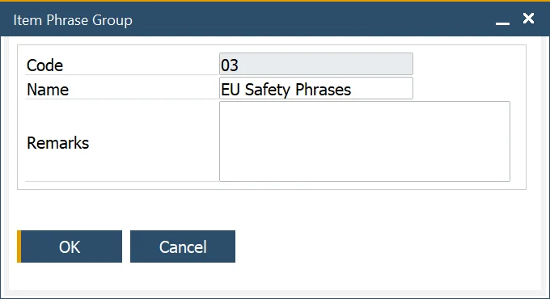
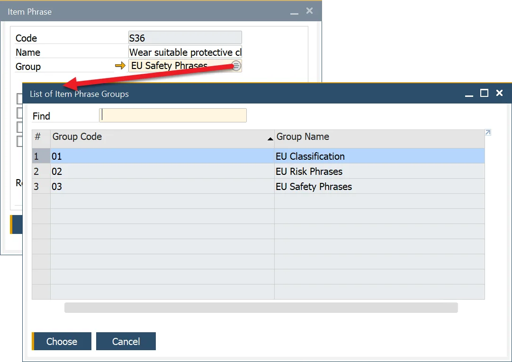

# Phrases

The Item Phrase form allows the user to define a specific phrase. Safety or Risk Phrases contain information about, e.g., special transport and storage requirements or hazards. Phrases are expressed in particular regulations, e.g., EU Risk and Safety Phrases. ProcessForce Item Phrases functionality is also helpful in creating a Material Safety Data Sheet for a specific Item.

## Item Phrases

:::note Path
    Administration → Setup → Item Details → Item Phrases
:::

You can choose on what kind of document a specific Item Phrase can be used (by checking a corresponding checkbox).

## Item Phrase Groups

:::note Path
    Administration → Setup → Item Details → Item Phrase Group
:::

The Item Phrase Group functions allow users to create groups of standard phrases, for example, EU Risk and EU Safety Phrases.

## Item Phrase Group assigning

:::note Path
    Administration → Setup → Item Details → Item Phrases
:::

The user can assign an Item Phrase Group to an Item Phrase by clicking a Group field and then the Choose From List icon:

## Item Phrase assigning

:::note Path
    Inventory → Item Details → Phrases tab
:::

Once created, a phrase can be assigned to an Item in the Item Details form, Phrases tab. By clicking a second column and then a Choose From List icon displayed within the field, a required phrase can be chosen:

A chosen phrase can be assigned to a specific document type by checking a checkbox in a required column.
