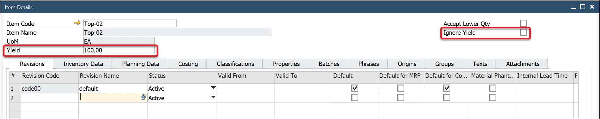

# Yield Master Data

You can set a default planned Yield percentage value in the Item Details form.

When the Item Details record is created, the Yield % value is set to 0.00 by default.

Check the Ignore Yield checkbox if you do not use the Yield percentage within a Bill of Material.

If the Item is a Parent Item, the default Yield percentage value is copied to the Bill of Materials form header. If the Item is added to the Items, Coproducts, and Scrap tab, this value is copied to the Yield field within the table.

If the Ignore Yield field is checked, the Yield field within the Items, Coproducts, and Scrap tabs will be set to 100.00.

These Yield values can be changed if required.

If the Item is a Parent Item, the default Yield percentage value is copied to the Bill of Materials form header. If the Item is added to the Items, Coproducts, and Scrap tab, this value is copied to the Yield field within the table.

If the Ignore Yield field is checked, the Yield field within the Items, Coproducts, and Scrap tabs will be set to 100.00.

These Yield values can be changed if required.
