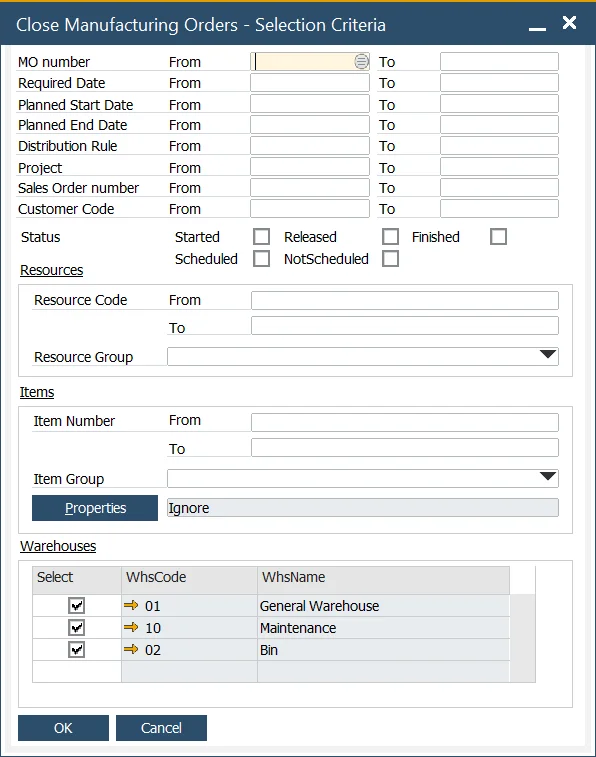
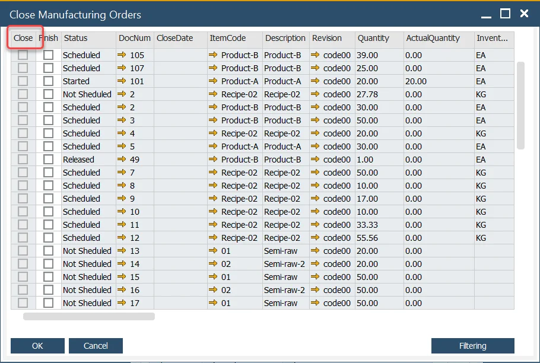
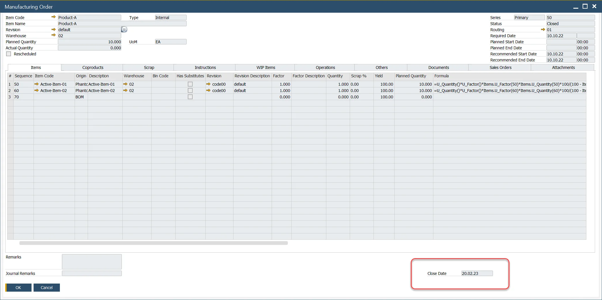

# Close Manufacturing Orders

This function allows the user to perform mass Finish and Close Manufacturing Orders.

:::info Path
    Production → Manufacturing Order → Close Manufacturing Order
:::

Multiple Selection Criteria can be set to filter Manufacturing Order and pick just the required ones.

Selected Manufacturing Orders can be individually checked or all checked by clicking the header of the Close column.

Using a Standard Costing System or Moving Average (if not using the Dynamic Costing) and the field within General Settings → ProcessForce tab → Costing Tab → Post Variance on Manufacturing Order Closure is checked, a WIP variance will be calculated and posted.

Note that the Close Date field for a specific row will be filled automatically with a current date after checking the Close checkbox for this row.

Close Date is displayed on Manufacturing Order:

## Filtering option

The option allows filtering Manufacturing Orders based on the standard SAP Business One option.
