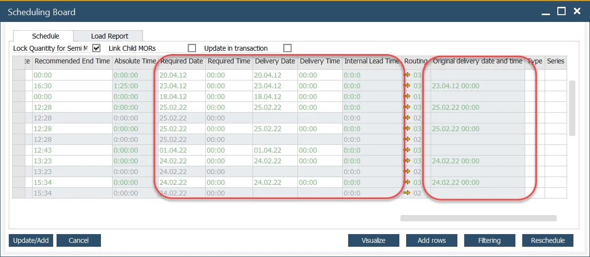

# Delivery, Receive and Required Date

Delivery, Receive, and Required Date allows one to calculate the exact date of production beginning required to deliver the product to the customer on time.

---

## Business Logic

Require, Delivery, and Receive data and Lead Times are connected and used on Manufacturing Orders and Sales Orders according to the following scheme:

The following data are being used for calculations:

- **Required Date, Time** – a moment on which production of Items from a specific Manufacturing Order has to be completed,
- **Internal Lead Time\*** – a period needed to prepare production results for shipping (sorting, assembling, packing, moving from a production floor to a shipping area, etc.). Required Date and Time + Internal Lead Time = Delivery Date and Time,
- **Delivery Date, Time** – a moment of sending output out of the company. Delivery Date and Time + Receive Lead Time = Receive Date and Time,
- **Receive Lead Time\*** – a period between sending the output and receiving it by Business Partner,
- **Receive Date, Time** – a moment of receiving the output by the Business Partner,
- **Delivery Time Slot\*** – preferred Delivery Time of receiving the output by Business Partner, e.g., 5 pm.

---

\* These values can be set up to calculate values of other dates.

## Configuration

### Internal Lead Time

Internal Lead Time can be defined in the following format: [1-3 digit number of days]:[1-2 digit number of hours]:[1-2 digit number of minutes].

<u>Example:</u>

Internal Lead Time can be defined in the following places:

1. `Business Partners → Business Partner Master Data → Addresses tab`

    If Business Partner has more than one address defined, different Internal Lead Times can be defined for each address.
2. `Business Partners → Business Partner Master Data → General tab`
3. `Inventory → Item Details → Revisions tab`
4. `Inventory → Item Master Data → Planning Data tab`
5. `Inventory → Warehouses → General tab`
6. `Administration → System Initialization → Document Settings → Per Document (for Sales Order)`

Internal Lead Time taken under consideration on specific documents (Manufacturing Orders and Sales Orders) is taken from the above hierarchy: if defined in 1. it is taken from there. If not, it is taken from 2. and so on.

### Receive Lead Time

Receive Lead Time can be defined in the following format: [1-3 digit number of days]:[1-2 digit number of hours].

1. `Business Partners → Business Partner Master Data → Addresses tab`

    If Business Partner has more than one address defined, different Delivery Times can be defined for each address.
2. `Business Partners → Business Partner Master Data → General tab`

3. `Inventory → Warehouses → General tab`
4. `Administration → System Initialization → Document Settings → Per Document (for Sales Order)`

Receive Lead Time taken under consideration on specific documents (Manufacturing Orders and Sales Orders) is taken from the above hierarchy: if defined in 1. it is taken from there. If not, it is taken from 2. and so on.

### Delivery Time Slot

Delivery Time is filled with a default value on Sales Order when selecting Business Partner on this type of document if it is defined in one of the following places:

1. `Business Partners → Business Partner Master Data → Addresses tab`

    If Business Partner has more than one address defined, a Different Delivery Time can be defined for each address.
2. `Business Partners → Business Partner Master Data → General tab`

Delivery Time taken under consideration on Sales Orders is taken from the above hierarchy: if defined in 1. it is taken from there. If not, it is taken from 2.

## Usage

### Sales Order

#### Header

Delivery Time is predefined (check Configuration section).

Delivery Date and Receive Date can be set up manually. When one value is set up, the other is calculated based on it. Changing one of the values changes the other one. Receive Time is calculated using different values (check the Business Logic section).

#### Contents tab

Delivery Time is predefined (check Configuration section).

Receive Date and Time are taken from the document header. It can be changed: different Receive Date and Time can be set up for each document line.

### Manufacturing Order

:::info Path
    Production → Manufacturing Order → Manufacturing Orders
:::

The required Date and Time can be set up manually on the Manufacturing Order header.

### Scheduling Board

:::info Path
    Production → Manufacturing Order → Scheduling → Scheduling - Manufacturing Orders → Scheduling Board
:::

Changing the Required Date or Time affects the Delivery Date and Time.

Changing Delivery Date or Time affects Required Date and Time.

Internal Lead Time is predefined (check Configuration section).

#### Original delivery date and time

Data from a specific Manufacturing Order populate this field. When some data are changed on this form (changing Delivery Date or Time, or changing other data which results in changes in Delivery Date and Time), this value turns red and bold, informing users that the current Delivery Date and Time differ from previously planned on Manufacturing Order.

Click here to find out more about Scheduling Board.

## Receive date calculation

Sales Order Receive Date is calculated considering holidays defined in SAP Business One → System Initialization → Company Details → Accounting Data tab.
