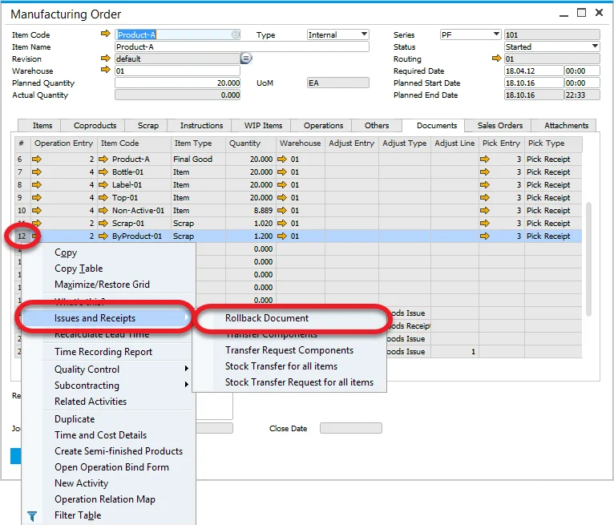
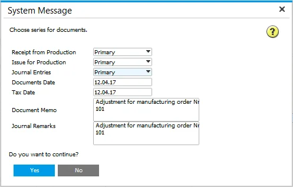
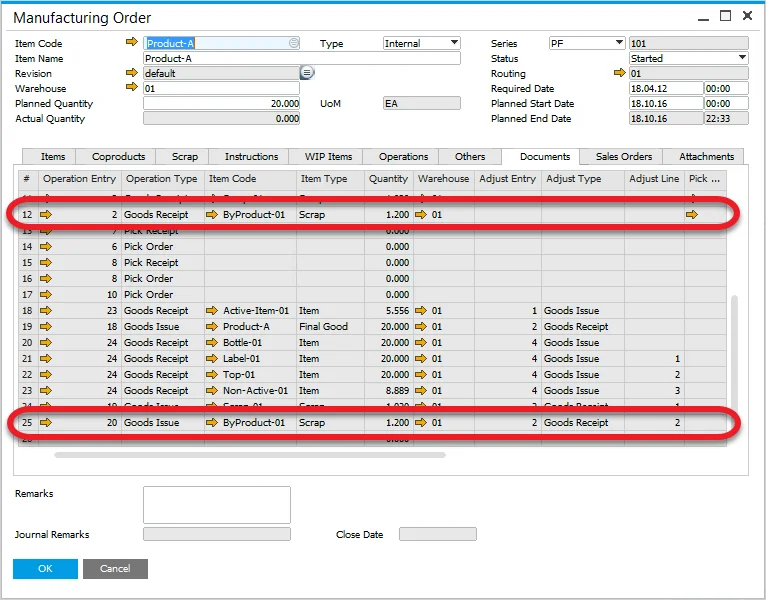

# Documents Rollback

You can use the Rollback Document option to correct Goods Issue or Goods Receipt documents.

To use this functionality, right-click on the document line (on a Manufacturing Order) you want to correct and choose Rollback Document from the context menu:

Rollback details form will be displayed. You can set up document series, dates, and additional remarks:

When you use Rollback Document on Goods Issue, it will create an appropriate Goods Receipt. In the same way, when you use Rollback Document on Goods Receipt, Goods Issue will be created.

When you use Rollback Document on Goods Receipt, and some documents are created using backflush, these documents will also be corrected.
