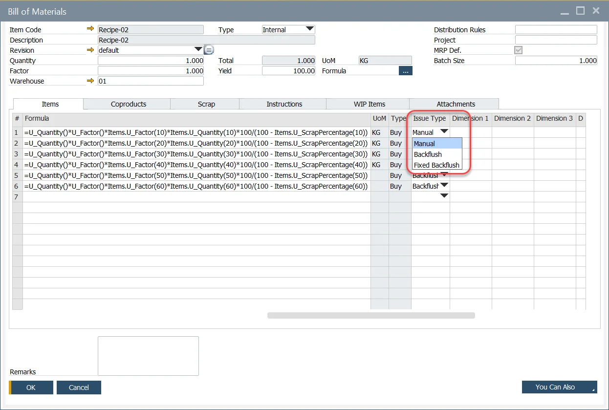

# Fixed Quantity Backflushing

## Bill of Material and Manufacturing Order

To backflush the total quantity of an Item based on a partial or a full quantity production receipt, select the "Fixed Backflush" option:

## Pick Order – Receipt from Production

Based on the "Backflush Type," the amounts to be posted are calculated based on the following rules:

|      Item       | BOM Quantity |   Type    |        Method         | Backflush Type  | MOR Planned Quantity | Planned Quantity | Receipt | Actual Quantity |
| :-------------: | :----------: | :-------: | :-------------------: | :-------------: | :------------------: | :--------------: | :-----: | :-------------: |
| Product 1 = BOM |      1       |           |                       |                 |         100          |                  |   10    |                 |
|  Ingredient 1   |     0.9      | Backflush | Proportional Quantity |    Backflush    |                      |        90        |         |        9        |
|  Ingredient 2   |     0.02     | Backflush |    Fixed Quantity     | Fixed Backflush |                      |        2         |         |        2        |
|  Ingredient 3   |     0.08     |  Manual   |                       |                 |                      |        8         |         |                 |

Partial Receipt of 10:

|      Item       | BOM Quantity |    Type     |        Method         | Backflush Type  | MOR Planned Quantity | Planned Quantity | Receipt | Actual Quantity |
| :-------------: | :----------: | :---------: | :-------------------: | :-------------: | :------------------: | :--------------: | :-----: | :-------------: |
| Product 1 = BOM |      1       |             |                       |                 |         100          |                  |   10    |                 |
|  Ingredient 1   |     0.9      |  Backflush  | Proportional Quantity |    Backflush    |                      |        90        |         |        9        |
|  Ingredient 2   |     0.02     |  Backflush  |    Fixed Quantity     | Fixed Backflush |                      |        2         |         |        2        |
|  Ingredient 3   |     0.08     |   Manual    |                       |                 |                      |        8         |         |        0        |
|   CoProduct 1   |     0.1      | Backflushed | Proportional Quantity |    Backflush    |                      |        10        |         |        1        |
|   CoProduct 2   |     0.2      | Backflushed |    Fixed Quantity     | Fixed Backflush |                      |        20        |         |       20        |
|   CoProduct 3   |     0.3      |   Manual    |                       |                 |                      |        30        |         |        0        |
|     Scrap 1     |     0.1      | Backflushed | Proportional Quantity |    Backflush    |                      |        10        |         |        1        |
|     Scrap 2     |     0.2      | Backflushed |    Fixed Quantity     | Fixed Backflush |                      |        20        |         |       20        |
|     Scrap 3     |     0.3      |   Manual    |                       |                 |                      |        30        |         |        0        |

Balance of Receipt 90:

|      Item       | BOM Quantity |    Type     |        Method         | Backflush Type  | MOR Planned Quantity | Planned Quantity | Receipt | Actual Quantity |
| :-------------: | :----------: | :---------: | :-------------------: | :-------------: | :------------------: | :--------------: | :-----: | :-------------: |
| Product 1 = BOM |      1       |             |                       |                 |         100          |                  |   90    |                 |
|  Ingredient 1   |     0.9      |  Backflush  | Proportional Quantity |    Backflush    |                      |        90        |         |       81        |
|  Ingredient 2   |     0.02     |  Backflush  |    Fixed Quantity     | Fixed Backflush |                      |        2         |         |        0        |
|  Ingredient 3   |     0.08     |   Manual    |                       |                 |                      |        8         |         |        0        |
|   CoProduct 1   |     0.1      | Backflushed | Proportional Quantity |    Backflush    |                      |        10        |         |        9        |
|   CoProduct 2   |     0.2      | Backflushed |    Fixed Quantity     | Fixed Backflush |                      |        20        |         |        0        |
|   CoProduct 3   |     0.3      |   Manual    |                       |                 |                      |        30        |         |        0        |
|     Scrap 1     |     0.1      | Backflushed | Proportional Quantity |    Backflush    |                      |        10        |         |        9        |
|     Scrap 2     |     0.2      | Backflushed |    Fixed Quantity     | Fixed Backflush |                      |        20        |         |        0        |
|     Scrap 3     |     0.3      |   Manual    |                       |                 |                      |        30        |         |        0        |

Over Receipt of 10:

|      Item       | BOM Quantity |    Type     |        Method         | Backflush Type  | MOR Planned Quantity | Planned Quantity | Receipt | Actual Quantity |
| :-------------: | :----------: | :---------: | :-------------------: | :-------------: | :------------------: | :--------------: | :-----: | :-------------: |
| Product 1 = BOM |      1       |             |                       |                 |         100          |                  |   10    |                 |
|  Ingredient 1   |     0.9      |  Backflush  | Proportional Quantity |    Backflush    |                      |        90        |         |        9        |
|  Ingredient 2   |     0.02     |  Backflush  |    Fixed Quantity     | Fixed Backflush |                      |        2         |         |        0        |
|  Ingredient 3   |     0.08     |   Manual    |                       |                 |                      |        8         |         |        0        |
|   CoProduct 1   |     0.1      | Backflushed | Proportional Quantity |    Backflush    |                      |        10        |         |        1        |
|   CoProduct 2   |     0.2      | Backflushed |    Fixed Quantity     | Fixed Backflush |                      |        20        |         |        0        |
|   CoProduct 3   |     0.3      |   Manual    |                       |                 |                      |        30        |         |        0        |
|     Scrap 1     |     0.1      | Backflushed | Proportional Quantity |    Backflush    |                      |        10        |         |        1        |
|     Scrap 2     |     0.2      | Backflushed |    Fixed Quantity     | Fixed Backflush |                      |        20        |         |        0        |
|     Scrap 3     |     0.3      |   Manual    |                       |                 |                      |        30        |         |        0        |
