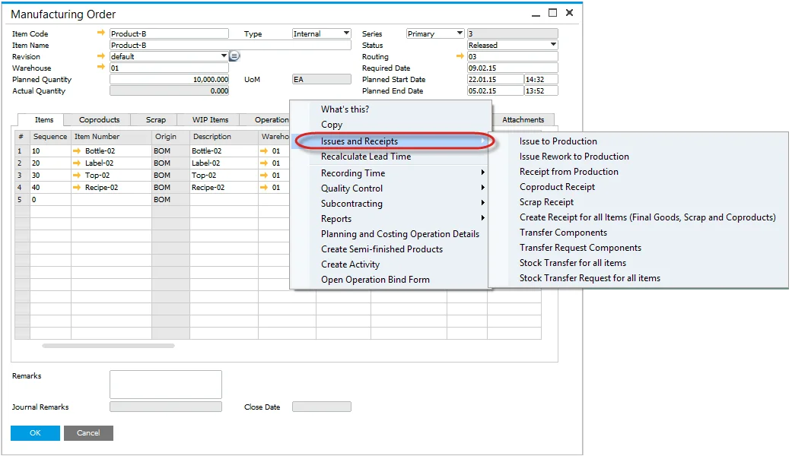
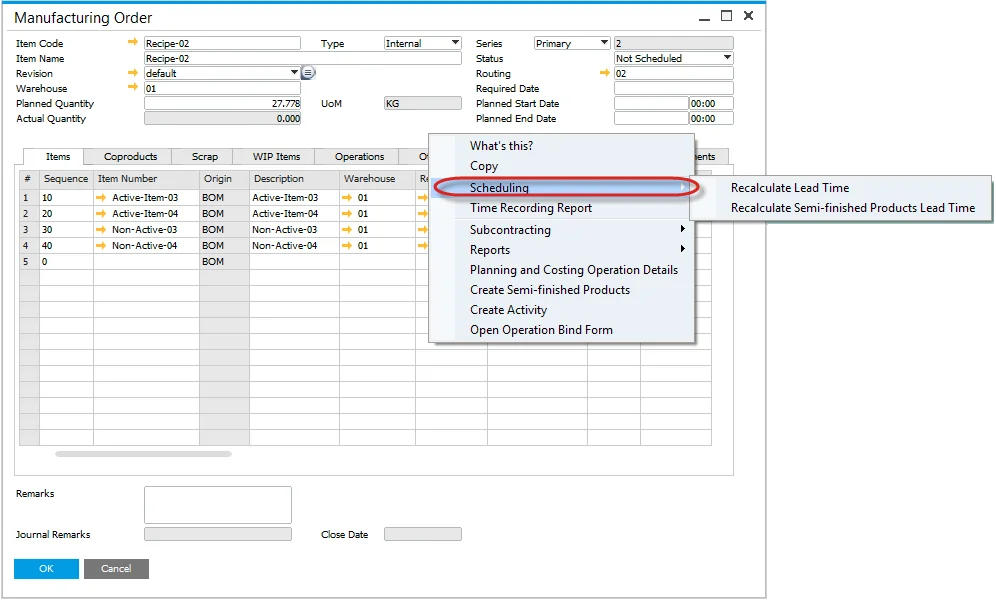
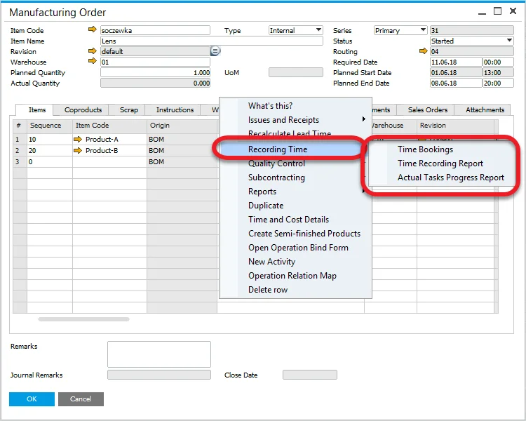
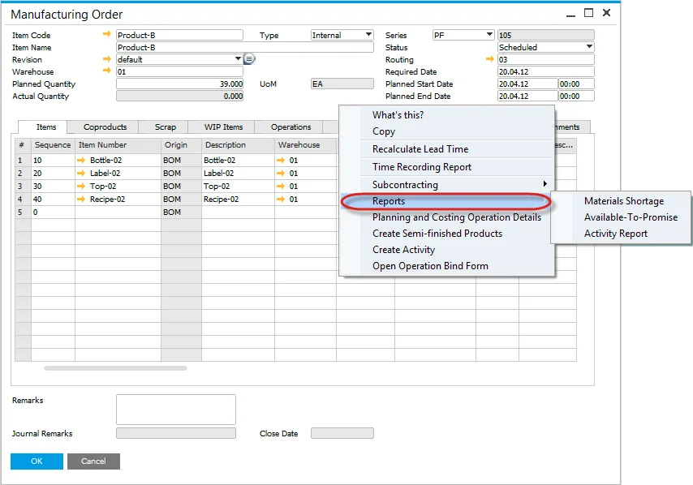
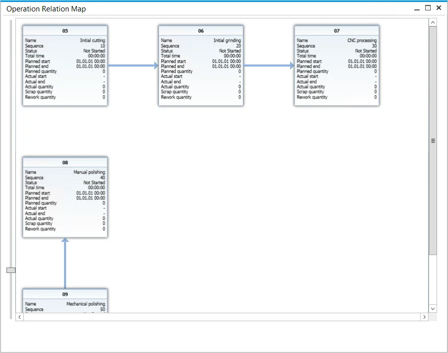
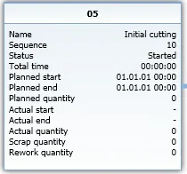

# Manufacturing Order Menus

Right-click Menus within the Manufacturing Order leads to several Manufacturing Order options.

## Issues and Receipts

Issues and Receipts

All related inventory issues, receipt, and transfer functions are available from this sub-menu level. To be known, the Manufacturing Order must have Released or Started status to Issues and Receipts.

## Scheduling

## Recording Time

### Actual Tasks Progress Report

This option opens a form containing a table with information on currently started CompuTec PDC tasks.

The option is available when Manufacturing Order is in Released, Started, or Finished status.

## Reports

## Operation Relation Chart

To get to this option, choose Operation Relation Map from a context menu on Manufacturing Order.

The chart shows information connected to each of the operations assigned to a production process for a specific Manufacturing Order. Additionally, the chart shows relations between functions that, by default, are sequential (one Operation is finished, and another starts). Operation relations can be more advanced than that.

### Operation Tile

Apart from basic information (Operation Name, Sequence, Status), the Tile also holds information on the operation's times: start and end of work (both planned and actual) and period of work.

#### Operation quantity

In this application version, information on Operation related quantities has been added.
