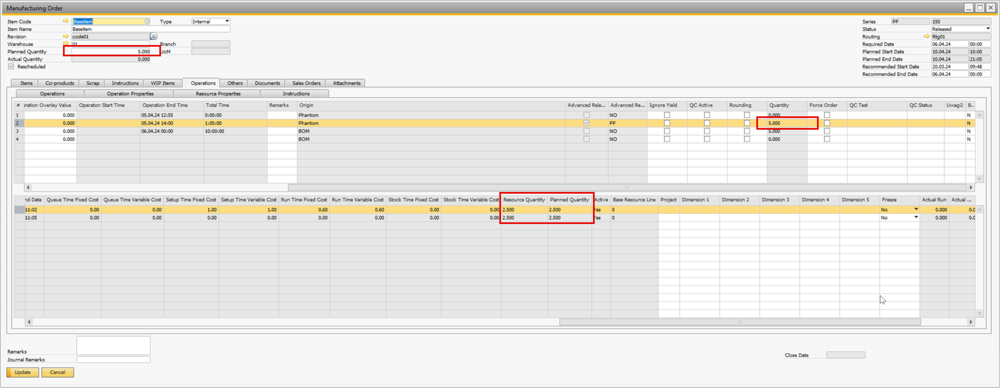
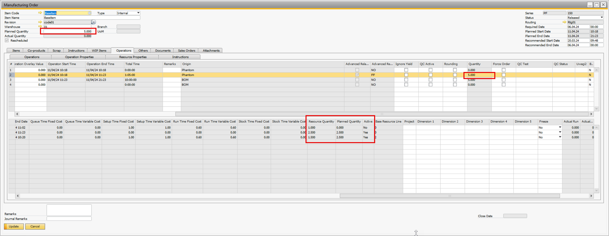

# Manufacturing Order Scheduling

Scheduling production orders is one of the key aspects of operating in a manufacturing environment. Each resource is assigned a specific quantity that is considered during the planning phase.

## Planned Quantity

It refers to the predetermined allocation of quantity, which is always distributed among machine resources. If a resource is inactive due to the establishment of a new production line, its allocation is set to zero.

## Resource Quantity

It represents the current planned quantity following the latest replanning session. This figure incorporates the quantities already registered. For inactive resources, the total registered quantities are summed up.

**Example**

After Time Booking for first resource (booked 1 qty)

