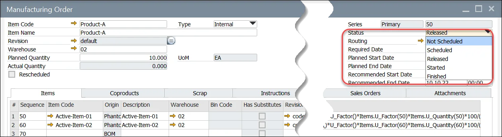

# Manufacturing Order Statuses

Manufacturing Order has to have a status assigned. Every status indicates different actions that can be performed on a specific Manufacturing Order. A Manufacturing Status can be assign in a Manufacturing Order header.

---

Available statuses:

**Not Scheduled** – Manufacturing Order does not have a due date defined

**Scheduled** – dates are determined for Manufacturing Order, but nothing can be issued to / receipt from production yet

**Released** – dates are determined for Manufacturing Order; it is possible to issue to / receipt from production

**Started** – Manufacturing Order changes automatically to this status on any related issue to production or operation start. It is possible to adjust this status manually. Manufacturing Orders with this status should not be re-scheduled

**Finished** – blocks Manufacturing Order but there is still an option to change the status.

**Closed** – details of the Manufacturing Order with this status cannot be changed anymore. Optionally changing to this status can also make journal entries based on Manufacturing Order variance (when option Post variance on Manufacturing Order closure is set in General Settings).

You can also use a mass Manufacturing Order status change tool to change the status of many Manufacturing Orders at once.

## Manufacturing Order status change through CompuTec PDC

Starting operation in CompuTec PDC changes Manufacturing Order status to Started on Resource Planning Board, Scheduling (if the status was Released)
