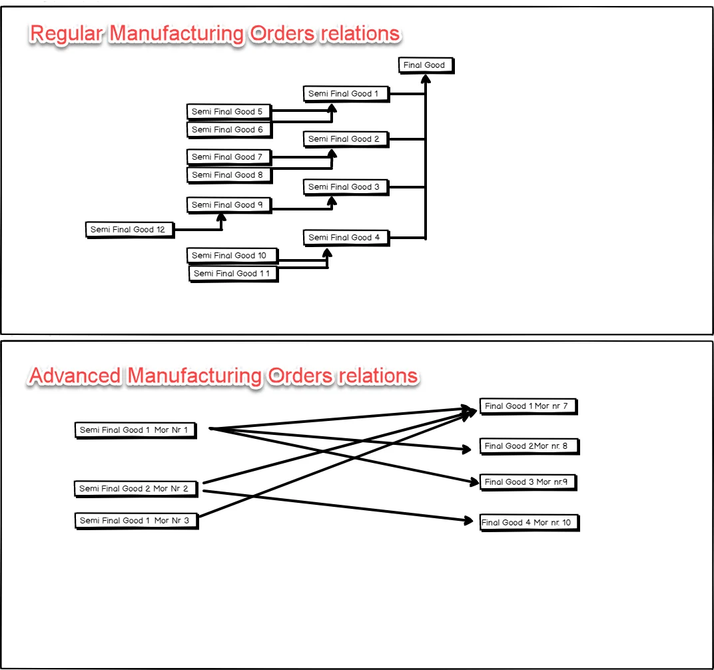
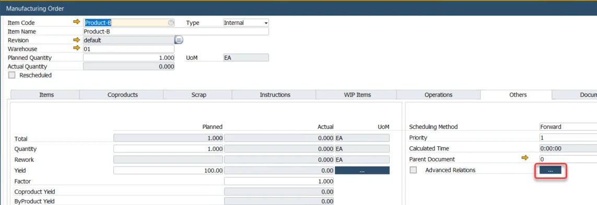
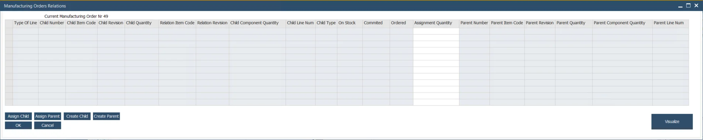
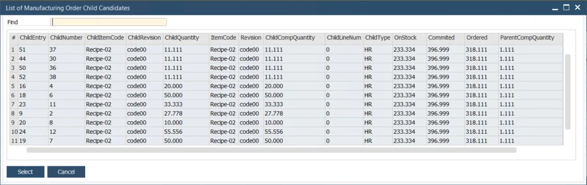

# Manufacturing Orders Relations

This option allows you to create advanced Manufacturing Orders relations and relate a Child Manufacturing Order with multiple Parent Manufacturing Orders.

---

## Purpose

## Activating the option

:::info Path
Production → Manufacturing Order → Manufacturing Order → Others tab
:::

Click the highlighted button to open the Manufacturing Orders Relations form.

## Manufacturing Orders Relations form

### Creating relation

#### Assigning already existing Manufacturing Orders

##### Assigning child Manufacturing Orders

Clicking the Assign Child button leads to the list of all Manufacturing Orders in Scheduled, Released, and Started status for an Item and Revision of a component of the Manufacturing Order. Choose one or more and click Select. This will add lines to the main form.

##### Assigning parent Manufacturing Orders

Clicking the Assign Parent button leads to the list of all Manufacturing Orders in Scheduled, Released, and Started status with a component of the chosen Manufacturing Order.

#### Creating new Manufacturing Orders

##### Creating new Child Manufacturing Order

Clicking the Created Child button leads to a list of all Bill of Materials that match the Raw material of the chosen Manufacturing Order.

##### Creating new Parent Manufacturing Orders

Clicking the Create Parent button leads to a list of all Bill of Materials that have a component of the chosen Manufacturing Order.

#### Visualize

This option allows for checking a scheme of connections between Manufacturing Orders.
