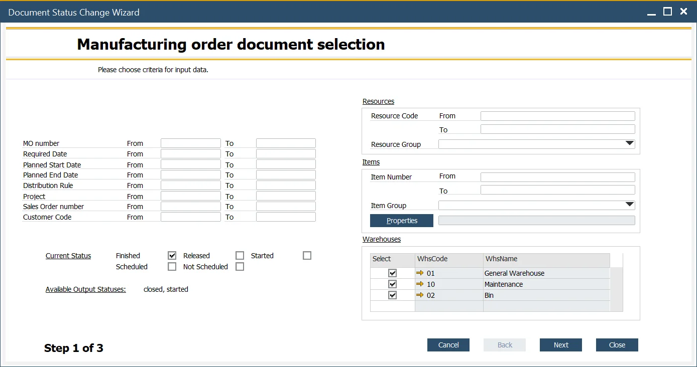
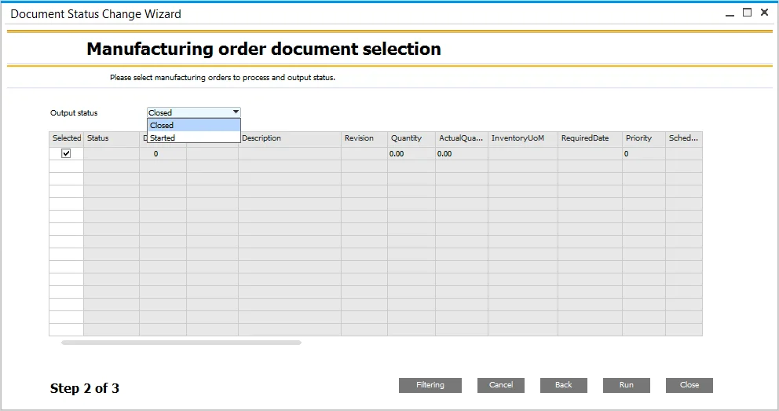
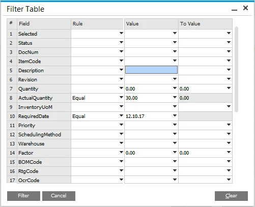
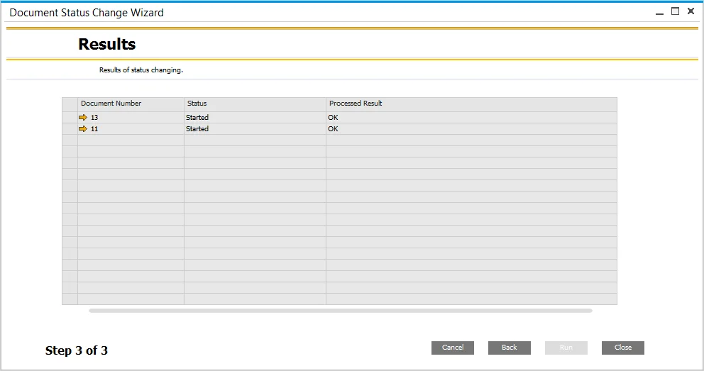

# Mass Manufacturing Order Status Change

This function allows to change status of many Manufacturing Orders in the same time.

---

:::note Path
    Production > Manufacturing Order > Document Status Change Wizard
:::

## Possible Status Changes

|                      From                      |                     To                      |
| :--------------------------------------------: | :-----------------------------------------: |
|                    Released                    | Not Scheduled, Scheduled, Started, Finished |
|                    Finished                    |               Closed, Started               |
|                   Scheduled                    |      Not Scheduled, Released, Finished      |
|                 Not Scheduled                  |        Scheduled, Released, Finished        |
|                    Started                     |              Finished, Closed               |
|           Scheduled + Not Scheduled            |             Released, Finished              |
|            Released + Not Scheduled            |             Finished, Scheduled             |
|              Released + Scheduled              |           Finished, Not Scheduled           |
|              Released + Finished               |                   Started                   |
|               Released + Started               |                  Finished                   |
|               Started + Finished               |                   Closed                    |
|            Started + Not Scheduled             |                  Finished                   |
|      Started + Scheduled + Not Scheduled       |                  Finished                   |
|       Started + Released + Not Scheduled       |                  Finished                   |
|         Started + Released + Scheduled         |                  Finished                   |
|      Released + Scheduled + Not Scheduled      |     Released, Scheduled, Not Scheduled      |
| Started + Released + Not Scheduled + Scheduled |                  Finished                   |

There are three steps in the process of mass Manufacturing Order status change:

### Step 1. Selecting criteria

#### Manufacturing Order Data

On the left side of the form, you can choose several options connected to Manufacturing Order data, e.g., document number, date (required date, planned start date, planned end date), distribution rule, project, source Sales Order, and customer.

Options can be combined.

#### Status

Check the required checkbox to choose input status. When checkbox/es are checked, information about available status changes is displayed (or a warning if information about checkboxes is not available). Check the table above, column From, for possible checkbox check unavailable.

#### Resources, Items

You can choose a Resource Group and one Resource or a range of Resources (based on Resource number).

You can choose an Item in the same way.

#### Warehouse

You can limit chosen records list to those connected to specific Warehouses (Select column check-boxes).

Click the Next button after setting up desired criteria.

### Step 2. Manufacturing Order Selection

In the second step, you have a list of Manufacturing Orders filtered using the criteria in the previous step. You can choose which document status will be changed (by checkboxes in the Select column).

#### Filtering

It is possible to additionally filter the results by clicking the Filtering button and setting up filtering criteria to get specific values from chosen fields:

You can define rules (e.g., equal, not equal, contains, is empty) and values that will be affected by the rule. A list of rules.

Choose output status (you can find available options in the Possible Status Changes section).

Click the Run button after setting up the above details.

### Step 3. Results

In this step, you can see the mass document status change results. If the status of a specific document cannot be changed, a message will be displayed in the Processed Result column, e.g., Please fill required date first.
