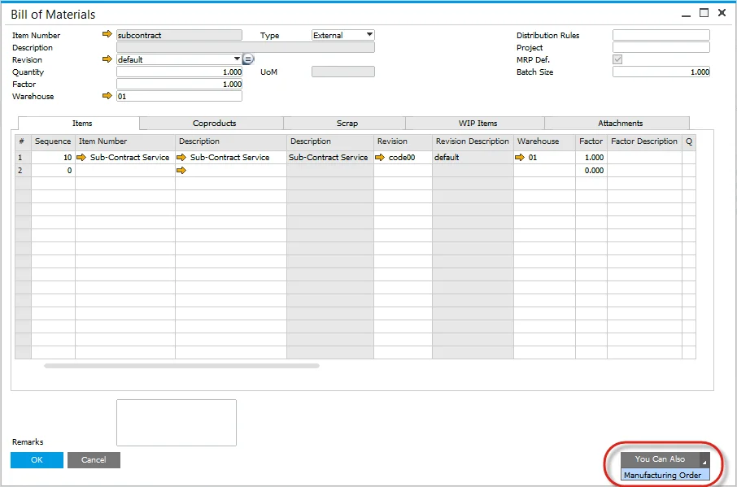

# Overview

There are multiple ways to create a Manufacturing Order.

## From Bill of Materials form

- Click on the `You Can Also`
- Select Manufacturing Order

## Manually from the Production menu

:::note Path
    Production → Manufacturing Order → Manufacturing Order
:::

## From a Sales Order

- Enter the Delivery Date
- Select the Item Code; the default revision will be automatically entered
- Enter the Quantity
- Add the Sales Document
- Refresh the Sales Document
- From the Context Menu select Create Manufacturing Order

    

- Manufacturing Order Form will open
- Sales Order Delivery Date is copied to the Required Date
- Sales Order Item Code, Revision Code, and Quantity are copied also
- Manufacturing Order is automatically scheduled based on the Backwards scheduling method from the Required Date

    

    

- The Sales Order and Manufacturing Order documents are pegged together

    

## From MRP Wizard - Order Recommendation

- Run MRP Wizard
- Save Recommendations
- Open Order Recommendations
- Select Orders to create
- Press Update

