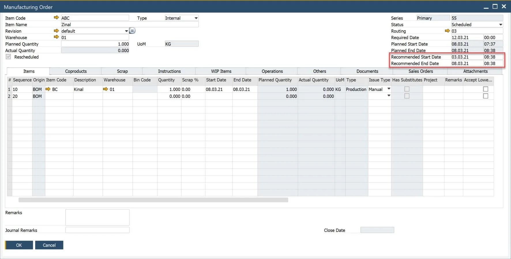

# Recommended Start/End Date

These two fields allow the user to enter the expected order completion dates. They allow you to record expectations as of the time frame of the order.

1. Recommended Start Date allows you to specify a start date other than the Required Date.
2. Recommended End Date is calculated based on Recommended Start Date and Lead Time.

These dates are used in Scheduling (Recalculate Lead Time): Start Date for the Forward method, the End date for Backward Method

They do not affect MRP calculations.

The purpose of Recommended Start-End Date/Time is to allow a user to determine the start or the end date of the Manufacturing Order depending on the scheduling method. For example, if you use the Forward way, the system determines the planning start date as Today or as soon as a related resource has available time. You can define Recommended Start Date and select the earliest date MO should be started. If you are using the Backward method, it is the same for the end date.
