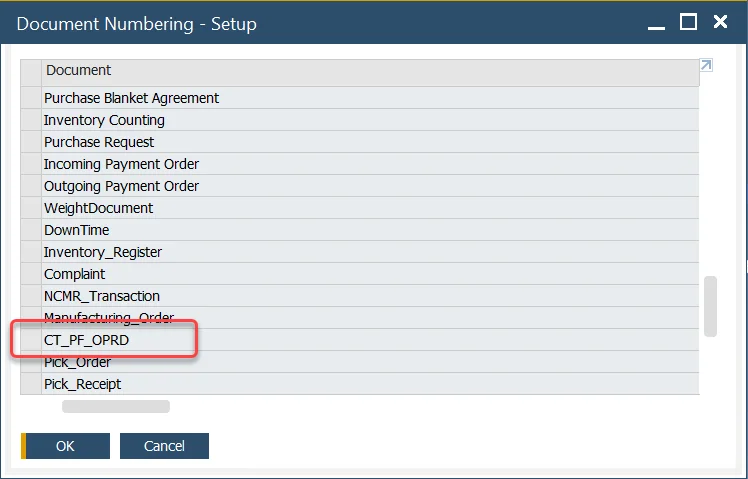

# Orderless Production

You can find information on setting up and using the Orderless Production function on this page.

---

## Configuration

### Master Data

Define Document Series for the Orderless Production Document:

You can check here how to set up <!-- TODO: Add Link --> a document series.

### Bill of Material

When performing orderless production, all items and resources within the Bill of Material and Production Process must be set as "Backflushed."

### Orderless Production Template

To reduce the time to enter the items to be produced in an orderless method, a template can be created listing all the items to be produced.

This template can be selected in the Orderless Production Document, and all the data is copied into the form.

If an Item has associated CoProducts and Scrap, these are automatically added to the form.

## Orderless Production Document

The user can select an orderless production template and manually add items to the form to record the items to be produced.

If an Item has associated CoProducts and Scrap, these are automatically added to the form.

The user enters the posting date and quantity produced, and press add.

This will create in the background a manufacturing order performing a complete manufacturing order cycle from release to close, including the following transaction:

|                           |       Items        | Batch Traced Items (set to backflush) Based on FIFO, FEFO & FMFO rules | Non-Inventory Items (set to backflush) | CoProducts (set to backflush) | Scrap (set to backflush) |   Resource Time    | Finished Products  |
| :-----------------------: | :----------------: | :--------------------------------------------------------------------: | :------------------------------------: | :---------------------------: | :----------------------: | :----------------: | :----------------: |
|         Backflush         |                    |                           :heavy_check_mark:                           |           :heavy_check_mark:           |      :heavy_check_mark:       |    :heavy_check_mark:    | :heavy_check_mark: |                    |
|    Create Batch Number    |                    |                                                                        |                                        |      :heavy_check_mark:       |    :heavy_check_mark:    |                    | :heavy_check_mark: |
|      Create Journals      | :heavy_check_mark: |                           :heavy_check_mark:                           |           :heavy_check_mark:           |      :heavy_check_mark:       |    :heavy_check_mark:    | :heavy_check_mark: | :heavy_check_mark: |
| Create Scrap & ByProducts |                    |                                                                        |                                        |                               |    :heavy_check_mark:    |                    |                    |
|     Create CoProducts     |                    |                                                                        |                                        |      :heavy_check_mark:       |                          |                    |                    |
| Create Finished Products  |                    |                                                                        |                                        |                               |                          |                    | :heavy_check_mark: |
