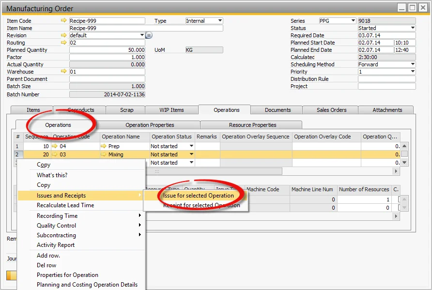
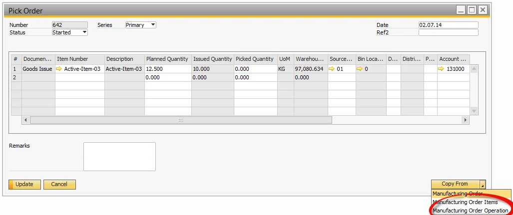
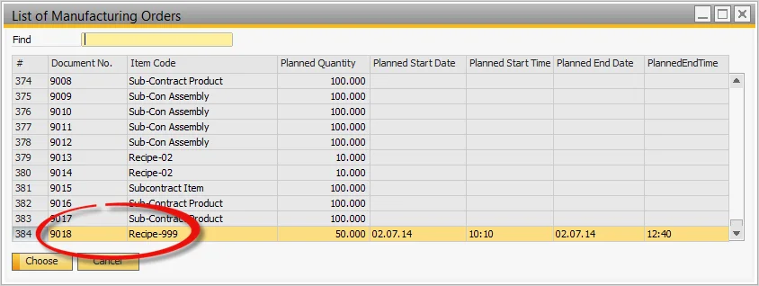
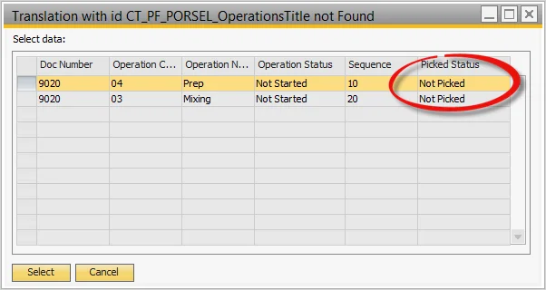
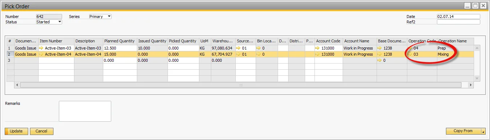

# Issue to Operation alternative Processes

You can find information on Issues with Operation Alternative Processes on this page.

---

## The issue to Operation from the Operations Tab

- Select the Operations Tab,
- Select the Operation,
- Select Issue for selected Operation.

## Copying Issue to Operation from the Pick Order Process

- Select the Pick Order from within the Manufacturing Order from the Menu,
- Select Copy From,
- Select Manufacturing Order Operation,

  

- A list of Manufacturing Orders is displayed,
- Select one or several Manufacturing Orders,

  

- A list of Operations for the Manufacturing Order or Orders are displayed,
- Select a single row or multiple rows

  

- Items linked to the Operation are copied into the Pick Order.

