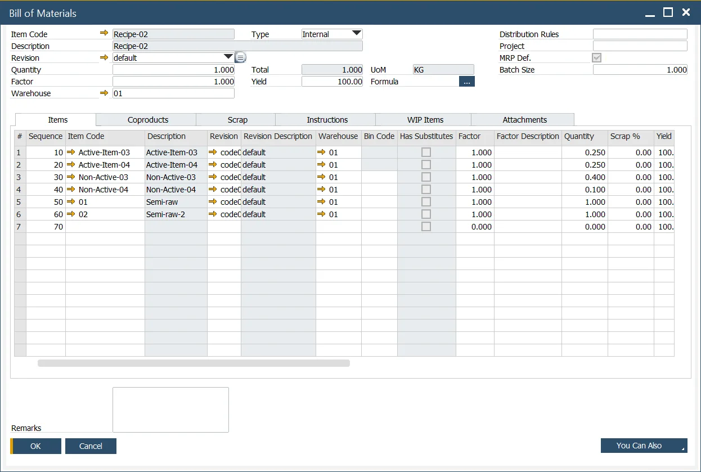
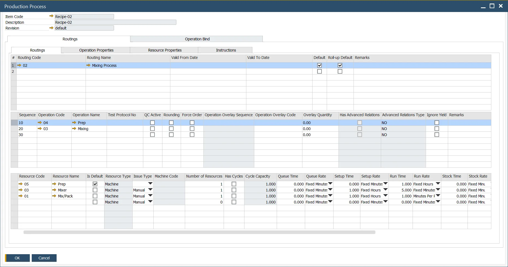
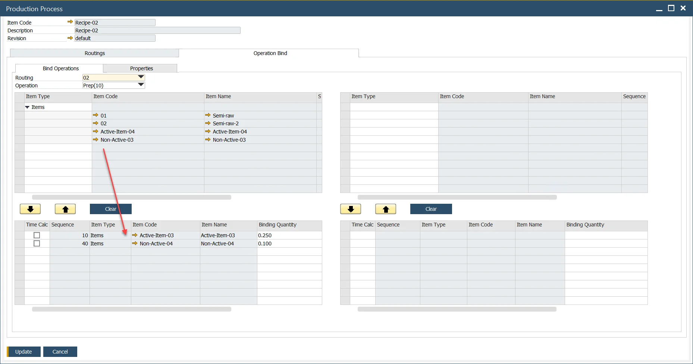
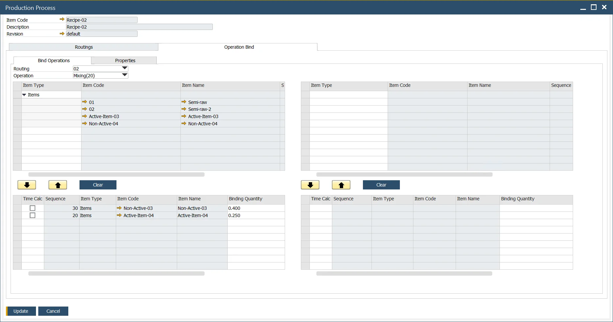

# Master Data

In this section, you can check how to set Master Data for a Pick Issue and Receipt by Operation.

## Bill of Materials

- Define the Items, Coproducts, and Scrap within the bill of materials form as normal,
- Note the Item Number and Description are "Grey." This indicates the items have been linked to an Operation.

## Production Process

Define the Production Process as usual. You can reach this form by Main Menu (Production → Bill of Materials → Production Process) or by the context menu from the Bill of Materials form.

## Operation Binding

- Left side of the form represents Inputs, and the Right side of the form Outputs,
- Select the Routing and the Operation,
- Select the Items and link to the Operation,
- In this example, Active-Item-03 and Non-Active-04 are linked as an Input to the Prep operation.

In this example, CoProduct Item Co-Product-01 and Scrap Item Scrap-01 are linked as an Output from the Mixing operation.

