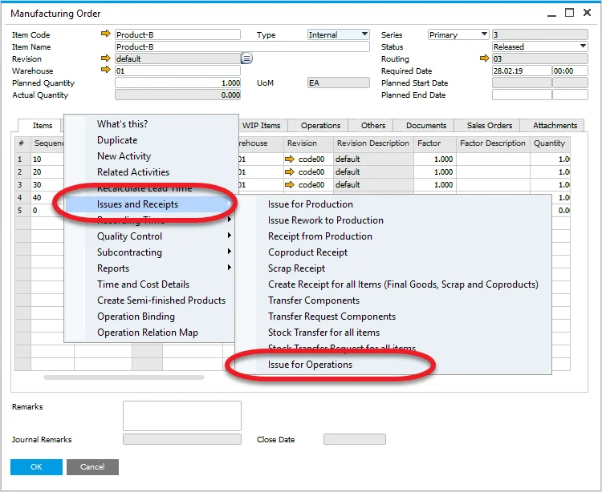
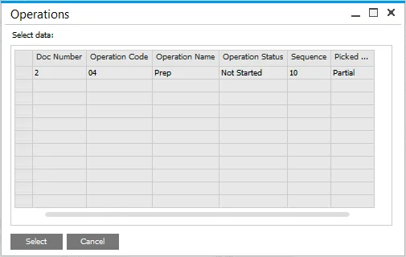
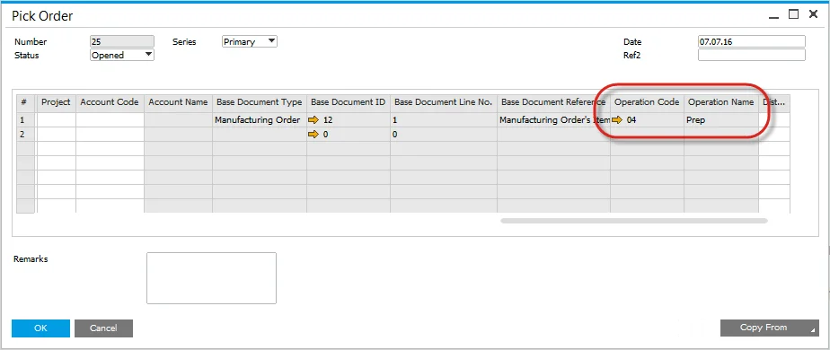
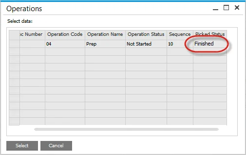
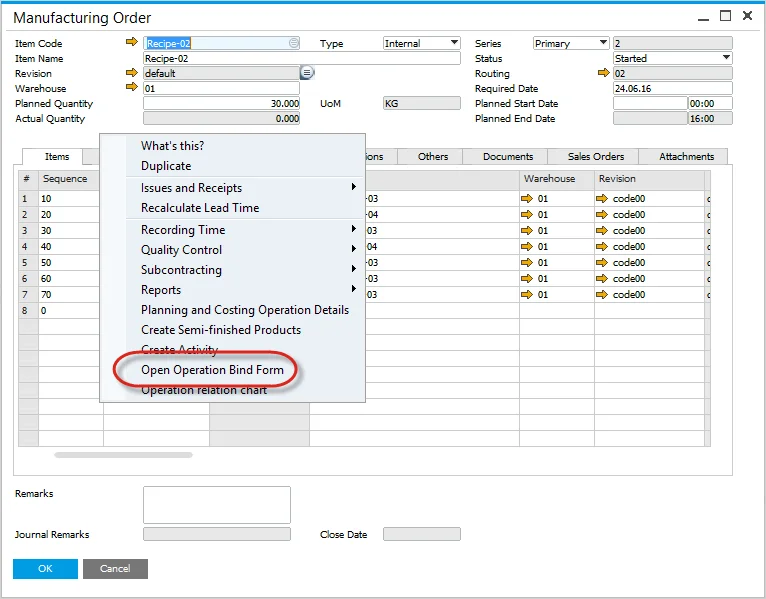
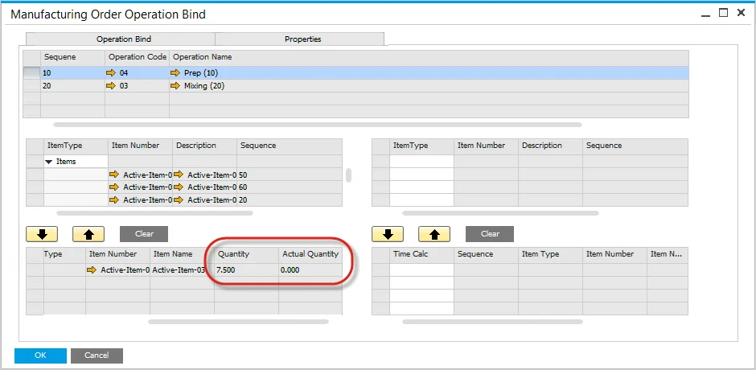

# Pick by Operation

You can find information on the Pick by Operation function on this page.

---

## Issue to Operation

- Select the Issue to Operations from the context menu on Manufacturing Order,
- This menu option will only be displayed if there is an Item linked to an Operation (you can check how to do this here <!-- TODO: Add Link -->),
- If an Item is not linked to an Operation, this menu will not be displayed.

  

- A List of Operations with linked Items will be displayed,
- Select a single or multiple row,
- Note the Operation Status is based on the Operations Tab and Time Bookings,
- Pick Status displays the progress of Picking,
- Valid values are:
  - Not Picked,
  - Partially Picked (status changes when a Pick Issue has been created),
  - Finished.

  

## Pick Order

- Pick Order form opens and displays the Items based on the selected Operation,
- Operation Code and Name are recorded as a reference,
- Perform the Pick Order process as normal.

## Pick Status

- When a Pick Order has been created and Items have been partially picked, the Picked Status will change to Picked.

  

- When Picking is complete the Picked Status will change to Finished.

  

## Operation Picking Status

- Open the Operation Bind Form to view a summary of the Operation Picking.

  

- Planned and Actual Quantities are displayed.

  
