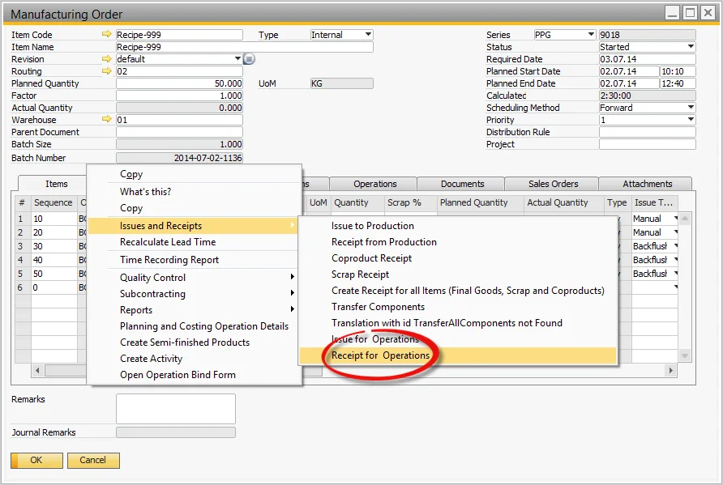
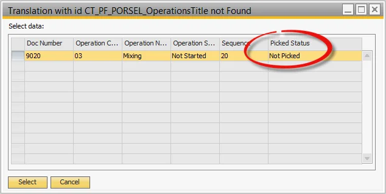
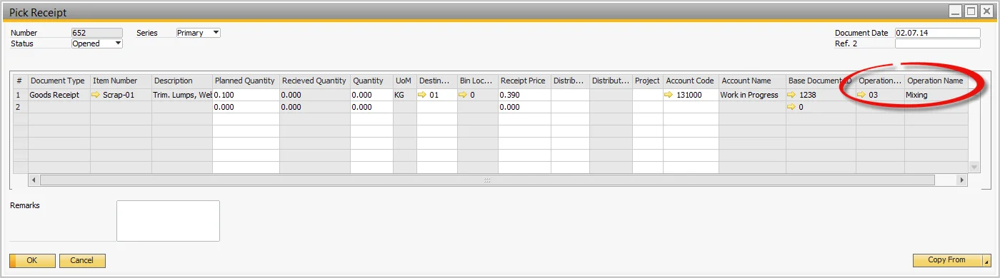

# Receipt by Operation

You can find information on the Receipt by Operation function on this page.

---

## Receipt for Operation

- Select the Receipt for Operation from te Manufacturing Order's context menu.

  

- List of Operations is displayed with linked CoProduct and Scrap Outputs.

  

## Pick Receipt

- Pick Receipt form opens with the Output Items,
- Operation number and name are referenced,
- Perform the rest of the Pick Receipt process as normal.

